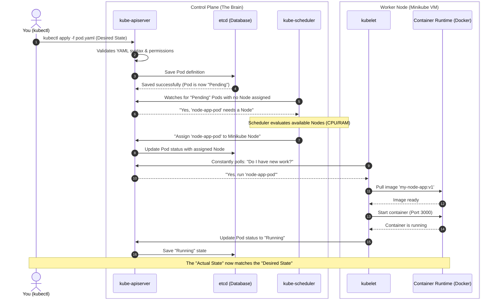
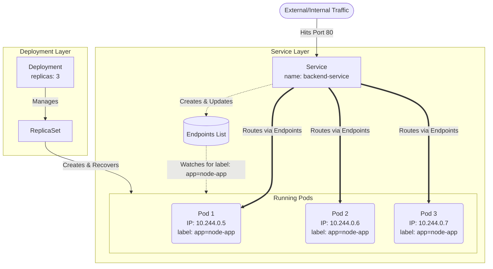

# Hardened Backend & Observability

This lab demonstrates how to build a production-grade, minimal-footprint backend using **Google Distroless** images and implement robust health monitoring.

## Learning Objectives
1.  **Distroless Images**: Using `gcr.io/distroless/nodejs20-debian12` to reduce attack surface and image size.
2.  **Health Checks**: Implementing native Docker health checks to monitor service "liveness".
3.  **Observability**: A secondary service that pings the API at 30-second intervals to verify uptime.
4.  **Multi-Stage Hardening**: Building in a full environment and running in a restricted one.

## Features
- **Fastify API**: Connected to PostgreSQL.
- **Distroless Runtime**: No shell, no package manager, just the binary.
- **Auto-Monitor**: A small shell-based service that "pulses" the API every 30s.

## Commands
```bash
# 1. Build and Start
docker-compose up --build

# 2. Monitor Logs
# Watch the 'monitor' service hit the API every 30s
docker-compose logs -f monitor

# 3. Check Health Status
docker inspect --format='{{json .State.Health}}' hardened-api
```
# Kubernetes

Deploying a Node.js App to a Single Pod
You asked to deploy this in a single Pod. While it's best practice to use a Deployment (as we discussed previously), creating a raw Pod is a great way to understand the absolute baseline of how Kubernetes runs a container.

Here is the step-by-step process.

## Step A: The "Minikube Docker Env" Gotcha
If you build a Docker image on your Mac normally, Kubernetes (inside the Minikube VM) cannot see it. We need to point your terminal to Minikube's internal Docker daemon first.

Run this command in your terminal:

```Bash
eval $(minikube docker-env)
```
(Note: This binds your current terminal tab to Minikube's Docker. Keep using this same tab for the next steps).

## Step B: Build the Image
Assuming you are in your Node.js project directory with a valid Dockerfile, build the image:

```Bash
docker build -t my-node-app:v1 .
```
## Step C: Write the Pod YAML
Create a file named pod.yaml and paste this inside:

```YAML
apiVersion: v1
kind: Pod
metadata:
  name: node-app-pod
  labels:
    app: my-node-app
spec:
  containers:
  - name: node-container
    image: my-node-app:v1
    imagePullPolicy: Never   # This forces K8s to use the local image we just built
    ports:
    - containerPort: 3000    # Change this to whatever port your Node app uses
```
## Step D: Deploy and Verify
Apply the YAML file to your Minikube cluster:

```Bash
kubectl apply -f pod.yaml
```
Check if it is running:

```Bash
kubectl get pods
```
(Wait until the status changes from ContainerCreating to Running).

## Step E: Access the Application
A raw Pod is not exposed to your Mac's network by default. To test it in your browser, create a temporary tunnel:

```Bash
kubectl port-forward pod/node-app-pod 3000:3000
```
Now, open your browser and go to http://localhost:3000. You should see your Node.js app!

### Here is the exact step-by-step flow of what happens under the hood when you deployed that Node.js app to Minikube.


## Breaking Down the Magic (Why We Needed Each Piece)

* **Steps 1 & 2 (API Server & etcd):** Your `kubectl` command only ever talks to the `kube-apiserver`. The API server writes your request into `etcd` (the database). At this exact millisecond, your Node.js app is just a database entry labeled "Pending".
* **Step 3 (Scheduler):** The `kube-scheduler` is constantly watching the API server. It sees a "Pending" pod that doesn't have a home yet. Because you are using Minikube, there is only one worker node available. The Scheduler tells the API server, "Assign this pod to the Minikube node."
* **Steps 4 & 5 (Kubelet & Runtime):** The `kubelet` (the foreman living on the Minikube worker node) is also constantly watching the API server. It suddenly sees: "Oh! The API server says a pod belongs to my node now." The `kubelet` takes over, reaches out to the Container Runtime (Docker), and says, "Start the `my-node-app:v1` container."
* **Step 6 (The Loop Closes):** The `kubelet` reports back to the API server that the container successfully started. The API server updates `etcd`, and the deployment is complete.

> **💡 Architectural Insight:** Notice that the **Controller Manager** is missing from this breakdown. Why? Because you created a raw Pod directly! The Controller Manager's job is to manage Deployments and ReplicaSets. By bypassing a Deployment and writing a `pod.yaml` directly, you acted as the manager yourself.

## NodePort Service (The Quick & Dirty Way)
A NodePort service is the fastest way to expose an app locally. It tells Kubernetes: "Open a specific port (between 30000-32767) on the physical Worker Node itself, and forward any traffic that hits that port directly to my Pod."

### 1. Create the Service YAML (service.yaml)

```YAML
apiVersion: v1
kind: Service
metadata:
  name: node-app-service
spec:
  type: NodePort             # <--- This is the key part
  selector:
    app: my-node-app-k8-single-pod         # Must match the label on your Pod
  ports:
    - port: 80               # Port inside the cluster
      targetPort: 3000       # Port your Node.js app is listening on
      nodePort: 30001        # Port opened on the physical node (Optional, K8s will pick one if omitted)
```

### 2. Apply and Access (in Minikube)
Run "kubectl apply -f service.yaml".
Because you are using Minikube (which runs in a VM), you need one extra command to get the VM's IP address and map it:

```Bash
minikube service node-app-service
```
This command will automatically open your browser to the correct local URL, completely bypassing the need for port-forward!

This is the final step to making your application truly production-ready.

# As we discussed earlier, a raw Pod is fragile. If the node crashes, or the app throws a fatal error, that Pod dies and stays dead. By wrapping your Pod in a Deployment, you assign a "Manager" to constantly monitor it and bring it back to life if it fails.

Here is exactly how to migrate your pod.yaml into a deployment.yaml.

## 1. The Anatomy of the Migration
You don't have to rewrite your Pod from scratch. You literally copy and paste your entire Pod specification into the template section of a Deployment.

Here is your new deployment.yaml:

```YAML
apiVersion: apps/v1
kind: Deployment
metadata:
  name: node-app-deployment
  labels:
    app: my-node-app-k8-single-pod
spec:
  replicas: 3                  # 1. The Manager: "I want 3 copies of this app running at all times"
  selector:
    matchLabels:
      app: my-node-app-k8-single-pod         # 2. The Glue: "I manage any pods with this label"
  
  template:                    # 3. The Blueprint (Everything below here is your old pod.yaml!)
    metadata:
      labels:
        app: my-node-app-k8-single-pod       # This label MUST match the selector above
    spec:
      containers:
      - name: node-container
        image: my-node-app-k8-single-pod:v1
        imagePullPolicy: Never # Still using your local Minikube Docker image
        ports:
        - containerPort: 3000
```
### What Changed?

* **`apiVersion: apps/v1`**: Deployments belong to the `apps` API group, whereas raw Pods belong to the core `v1` API.
* **`replicas`**: You are now telling Kubernetes exactly how many instances of your app you want running for high availability.
* **`selector`**: This is how the Deployment knows which Pods it owns.
* **`template`**: This is the cookie-cutter. Every time the Deployment needs to replace a crashed Pod or scale up, it stamps out a new Pod using the exact definition inside this block.

## 2. Applying the Upgrade
Because you already have a raw Pod running with the label app: my-node-app, applying the Deployment right now might cause confusion (the Deployment will see the existing Pod and try to manage it, but it might not perfectly match the template).

It is best to clean up the old setup first.

Step 1: Delete the raw Pod

```Bash
kubectl delete pod node-app-pod
```
(Notice how, because it was a raw Pod, nothing automatically restarted it. It is just gone.)

Step 2: Apply the Deployment

```Bash
kubectl apply -f deployment.yaml
```

Step 3: Watch the Manager work
Run this command to see the Deployment and the newly created Pods:

```Bash
kubectl get deployments
kubectl get pods
```
You should now see node-app-deployment showing 3/3 ready, and three distinct Pods running with randomly generated names (e.g., node-app-deployment-7f8b9c-xyz12).

## 3. Proving It Works (The Chaos Test)
Let's prove why you did this. You are going to act as a catastrophic server failure.

Copy the name of one of your running Pods.

Forcefully delete it:

```Bash
kubectl delete pod <your-pod-name>
```
Immediately run:

```Bash
kubectl get pods
```
You will see that Kubernetes instantly noticed the replica count dropped to 2, and within milliseconds, it started spinning up a brand new Pod to get the count back to 3.

And because you already set up your Service and Ingress in the previous steps, your [http://my-local-app.com](http://my-local-app.com) URL will continue working without interruption! The Service automatically detects the dead pod, removes it from the rotation, and sends traffic to the surviving pods.

## The Internal Data Flow (Mermaid Diagram)
Here is exactly how that YAML translates into cluster architecture and traffic flow.


## What this diagram shows:

* **The Deployment only cares about state. It ensures 3 Pods are running with the label app: node-app.
* **The Service only cares about networking. It uses the app: node-app selector to dynamically build its Endpoints List. If Pod 2 crashes and the Deployment replaces it, the Service instantly updates its Endpoints List with the new Pod's IP address.