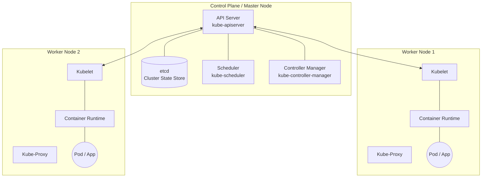
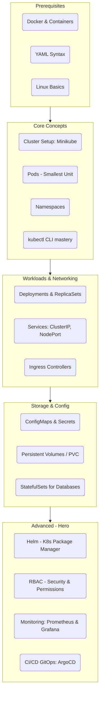

## Kubernetes Architecture & Main Components

Kubernetes operates on a "Control Plane / Worker Node" model. **Think of it like a restaurant:** the Control Plane is the manager coordinating everything, and the Worker Nodes are the kitchen staff doing the actual cooking.  

### 🧠 The Control Plane (The Brain)

| Component | Role | Description |
| :--- | :--- | :--- |
| **API Server** (`kube-apiserver`) | The front door | Every time you run a command or a component needs to communicate, it goes through this API. |
| **etcd** | The database | The cluster's highly-available database. It stores the exact state and configuration of your entire cluster. |
| **Scheduler** (`kube-scheduler`) | The dispatcher | When you ask K8s to run a new app, the scheduler evaluates your worker nodes and decides which one has the CPU and memory to handle it. |
| **Controller Manager** (`kube-controller-manager`) | The thermostat | It constantly monitors the cluster to ensure the "actual state" matches your "desired state". If a node crashes, the controller notices and spins up replacement pods elsewhere. |

---

### 💪 Worker Nodes (The Muscle)

| Component | Role | Description |
| :--- | :--- | :--- |
| **Kubelet** | The agent | Living on every node, it receives instructions from the API server and ensures your containers are actually running. |
| **Kube-Proxy** | The network manager | It maintains routing rules so traffic can securely reach your applications. |
| **Container Runtime** | The engine | The underlying engine (like `containerd` or Docker) that physically starts and stops the containers. |

## Architect Kubernetes


### Kubernetes Roadmap (Zero to Hero)

Follow this sequence. Do not skip to Phase 3 until you can do Phase 2 in your sleep.



To explain this, I'm going to use a Customer Support Call Center analogy. Imagine your web application is a company trying to answer customer phone calls (web requests).

### 1. The Pod: The Support Agent
A Pod is the smallest unit in Kubernetes. In our analogy, a Pod is a single customer support agent sitting at a desk, logged into their computer, ready to take calls.

* **What it is:** A Pod is simply a wrapper around your Docker container. If you have a Node.js backend, one Pod equals one running instance of that Node.js app.
* **The Catch:** Pods are mortal and fragile. If our support agent gets sick, spills coffee on their computer, or quits, that specific agent is gone forever. If a Pod crashes, Kubernetes doesn't try to fix it; it kills it and creates a brand new one.
* **Networking:** Every Pod gets its own internal IP address (like a direct desk extension). But because Pods die and get replaced constantly, that IP address is always changing. You can never rely on it.

### 2. The Deployment: The Floor Manager
Because individual agents (Pods) are unreliable, you can't run a business with just one. You need a Deployment, which acts as the Floor Manager.

* **What it is:** A Deployment is a set of instructions you give to Kubernetes. You tell the Deployment: "I always want exactly 3 support agents (Pods) working at all times."
* **Self-Healing:** If an agent gets sick (a Pod crashes), the Deployment immediately notices the count dropped from 3 to 2. It instantly hires a new agent (spins up a new Pod) to get the count back to 3.
* **Scaling & Updates:** If your app goes viral, you tell the Deployment to scale from 3 to 50. If you release version 2.0 of your app, the Deployment handles the rollout—firing the old agents one by one and replacing them with newly trained agents (v2.0 Pods) so the call center never experiences downtime.

### 3. The Service: The 1-800 Number (Switchboard)
We have a major problem right now. We have 3 agents (Pods) handled by a manager (Deployment), but they all have random, changing desk extensions (IP addresses). How does a customer actually reach them? 

You need a Service, which acts as your company's 1-800 Phone Number and Switchboard.

* **What it is:** A Service provides a permanent, unchanging IP address and DNS name for your group of Pods.
* **Load Balancing:** When a customer calls the 1-800 number (sends a request to the Service), the Service acts as a load balancer. It looks at all 3 available agents and routes the call to one that isn't busy.
* **Decoupling:** The Service doesn't care if a Pod died 5 seconds ago and was replaced by a new one with a new IP address. It automatically keeps track of the active agents. The frontend of your app only ever needs to talk to the Service's permanent address.

---

### The Complete Picture

| Concept | Call Center Analogy | Kubernetes Reality |
| :--- | :--- | :--- |
| **Pod** | The individual Agent | One instance of your running container. Highly ephemeral. |
| **Deployment** | The Floor Manager | Manages replicas, scaling, and rolling updates for Pods. |
| **Service** | The 1-800 Number | A stable IP/DNS name that load-balances traffic across the Pods. |

# Mastering Kubernetes: Architecture & State Reconciliation

To truly master Kubernetes and move beyond just copy-pasting YAML files, you have to understand its underlying philosophy: **State Reconciliation**.

Kubernetes is essentially an infinite loop constantly comparing two things:
* **Desired State:** What you asked for (e.g., *"I want 3 instances of my Node app running"*).
* **Actual State:** What is actually happening right now on the servers.

---

## 1. The Control Plane (The Brain)
The Control Plane is the collection of services that make global decisions about the cluster, detect and respond to cluster events, and manage the worker nodes.

| Component | Role | What it does | Pro-tip |
| :--- | :--- | :--- | :--- |
| **`kube-apiserver`** | The Gatekeeper | It is the front door to the entire cluster. Whether you are typing `kubectl` commands, or internal components are talking to each other, everything goes through the API server. | It is the **only** component allowed to talk directly to the database (`etcd`). It validates requests, checks permissions, and then updates the database. |
| **`etcd`** | The Brain's Memory | A highly-available, distributed key-value store. It holds the absolute "Source of Truth" for your cluster. It stores your secrets, your configuration, and the current state of every node and pod. | If `etcd` dies and you have no backup, your cluster effectively has total amnesia. The applications might keep running for a bit, but Kubernetes won't know they exist or how to manage them. |
| **`kube-scheduler`** | The Matchmaker | When you request a new Pod, it enters a "Pending" state. The scheduler watches for these pending Pods, looks at your available Worker Nodes, calculates which node has enough CPU and RAM, and assigns the Pod to that node. | The scheduler does **not** start the Pod. It just updates the API server to say, *"Hey, Pod X should run on Node Y."* |
| **`kube-controller-manager`** | The Enforcer | This runs various background "controllers" (like the Deployment controller). It sits in an infinite loop, constantly asking the API server, *"What is the desired state vs the actual state?"* | If you want 3 Pods and only 2 are running, the controller-manager tells the API server to create a 3rd one. |

---

## 2. The Worker Nodes (The Muscle)
These are the physical servers or virtual machines that actually run your application code.

| Component | Role | What it does |
| :--- | :--- | :--- |
| **`kubelet`** | The Foreman | An agent that runs on every single worker node. It constantly listens to the `kube-apiserver`. When the API server says *"Start Pod X on your node,"* the kubelet takes that order and tells the container runtime to execute it. It also reports the health of its node and pods back to the control plane. |
| **`kube-proxy`** | The Network Engineer | Runs on every node and manages the network rules (usually using Linux `iptables` or IPVS). When you create a Service, `kube-proxy` updates the networking rules on the node so that incoming traffic gets correctly routed to the actual Pods. |
| **Container Runtime** | The Engine | The actual software responsible for pulling the image from your registry (like Docker Hub or AWS ECR) and unpacking and running the container. *(**Pro-tip:** Kubernetes recently deprecated Docker as a runtime. Today, modern clusters usually use lighter runtimes like `containerd` or `CRI-O`.)* |

---

## 3. The Workloads (Your Application)
Now that we have the infrastructure, here is how your code actually runs on it.

* **Pod:** 
  * **Deep Dive:** A Pod is not a container; it's an environment for containers. All containers inside a single Pod share the same Network Namespace (they share the same IP address and can talk to each other via `localhost`) and can share storage volumes.
  * **Why?** Sometimes a backend app needs a sidecar container (like a log forwarder) right next to it. Putting them in the same Pod ensures they are always scheduled on the exact same physical node.
* **Deployment:** 
  * **Deep Dive:** A Deployment is actually a high-level wrapper around another resource called a `ReplicaSet`. When you update the image version in a Deployment, it creates a new `ReplicaSet` alongside the old one. It scales the new one up while scaling the old one down. This is how Kubernetes achieves zero-downtime rolling deployments.
* **Service:** 
  * **Deep Dive:** A Service gets a static virtual IP address (`ClusterIP`) assigned by the API server. Behind the scenes, the Service creates an `Endpoints` object. This object maintains a live, constantly updating list of the IPs of all healthy Pods attached to that Service. `kube-proxy` reads this list to know exactly where to route the traffic.

---

## 🚀 Putting It All Together: The "Aha!" Moment
When you type `kubectl apply -f app.yaml` to deploy your application, here is exactly what happens in milliseconds:

1. Your CLI sends the YAML to the **API Server**.
2. The API Server validates it and saves the "Desired State" to **`etcd`**.
3. The **Controller Manager** sees the new Deployment in the database, realizes there are 0 Pods, and tells the API Server to create new Pods.
4. The **Scheduler** sees these new "Pending" Pods, analyzes the nodes, and assigns the Pods to a specific Worker Node.
5. The **`kubelet`** on that Worker Node sees it was assigned a Pod. It tells the **Container Runtime** to pull your image and start the container.
6. Once running, **`kube-proxy`** updates the network rules so traffic hitting your **Service** flows smoothly into your newly running Pod.

## The `kubectl` Core Commands Table

As a DevOps engineer, you will type these commands dozens of times a day. `kubectl` always follows this syntax pattern:

`kubectl [action] [resource] [resource-name]`

| Command | Action | Meaning in Plain English |
| :--- | :--- | :--- |
| `kubectl get pods` | Viewing | "Show me a list of all running pods in the current namespace." |
| `kubectl get nodes` | Viewing | "Show me the physical/virtual servers in this cluster." |
| `kubectl describe pod [name]` | Debugging | "Give me the detailed history and event log for this specific pod. Crucial for finding out why a pod is crashing." |
| `kubectl logs [pod-name]` | Debugging | "Print the stdout/stderr console logs from the container inside this pod." |
| `kubectl apply -f [file.yaml]` | Creating | "Take this YAML file and make the cluster match whatever is written inside it (create or update)." |
| `kubectl delete -f [file.yaml]` | Destroying | "Remove the resources defined in this YAML file from the cluster." |
| `kubectl port-forward pod/[name] 8080:80` | Networking | "Temporarily map port 8080 on my Mac to port 80 on this pod so I can test it in my browser." |

1. The Magic Command: Mapping the Environment
To point your host machine's Docker CLI at Minikube's internal Docker daemon, run the environment mapping command specific to your operating system.

### For Mac / Linux:

```Bash
eval $(minikube docker-env)
```
### For Windows (PowerShell):

```PowerShell
minikube docker-env | Invoke-Expression
```

What just happened?
This command injected a few environment variables (like DOCKER_HOST and DOCKER_CERT_PATH) into your current terminal session. Now, when you run Docker commands, they are intercepted and sent inside the Minikube cluster.

2. Peek Under the Hood
Now, run the command you asked about:

```Bash
docker ps
```
Instead of your local containers, you will see a massive list of containers with names starting with k8s_. This is the Kubernetes Control Plane.

Here is the architectural breakdown of the main components you are looking at:

kube-apiserver: The brain of the cluster. Every single command you run via kubectl goes here. It is the only component that talks directly to the database.

etcd: The database. It is a highly-available key-value store that holds the entire "state" of your cluster. If you deploy an NGINX app, that configuration is saved here.

kube-scheduler: The dispatcher. When you ask for a new pod, the scheduler looks at all your worker nodes (Minikube only has one) and decides which node has enough CPU/RAM to host it.

kube-controller-manager: The watcher. It runs continuous background loops comparing the current state of the cluster to your desired state. If a pod crashes, the controller manager notices and tells the API server to spin up a replacement.

kube-proxy: The network manager. This runs on every node and maintains the network rules that allow pods to talk to each other and the outside world.

⚠️ The Modern Kubernetes Caveat
If you run docker ps after mapping the environment and it says there are no containers running, don't panic.

Kubernetes recently deprecated Docker as its default underlying container engine in favor of containerd. If your Minikube defaulted to containerd, mapping docker-env won't show the K8s components because Docker isn't running them.

If this happens, you can view the architecture using crictl (the CLI for containerd) by SSHing directly into the Minikube node:

```Bash
# 1. SSH into the Minikube node
minikube ssh

# 2. List the control plane containers using containerd
crictl ps
```
3. How to Undo the Mapping
Remember that eval $(minikube docker-env) only applies to your current terminal window. If you open a new tab, it will be back to normal.

If you want to un-map it in your current window and get your local Docker back, run:

### For Mac / Linux:

```Bash
eval $(minikube docker-env -u)
```
### For Windows:

```PowerShell
minikube docker-env -u | Invoke-Expression
```

### Kubernetes `kubectl` Command Reference

| Command | Description | Primary Control Plane Component |
| :--- | :--- | :--- |
| `kubectl get pods` | Lists all Pods in the current namespace. | `kube-apiserver` (Reads from `etcd`) |
| `kubectl get pods -o wide` | Lists Pods with extra details like IP address and Node. | `kube-apiserver` (Reads from `etcd`) |
| `kubectl get all` | Shows common Kubernetes resources such as Pods, Services, Deployments, and ReplicaSets. | `kube-apiserver` (Reads from `etcd`) |
| `kubectl get nodes` | Lists all Nodes in the Kubernetes cluster. | `kube-apiserver` (Reads from `etcd`) |
| `kubectl get deployments` | Lists Deployments and shows their desired/current/ready replicas. | `kube-controller-manager` |
| `kubectl get services` | Lists Services and their networking details. | `kube-apiserver` (Reads from `etcd`) |
| `kubectl get svc` | Short form of `kubectl get services`. | `kube-apiserver` (Reads from `etcd`) |
| `kubectl get namespaces` | Lists all namespaces in the cluster. | `kube-apiserver` (Reads from `etcd`) |
| `kubectl get pods -n <namespace>` | Lists Pods from a specific namespace. | `kube-apiserver` (Reads from `etcd`) |
| `kubectl describe pod <pod-name>` | Shows detailed information and events about a Pod. | `kube-apiserver` (Reads from `etcd`) |
| `kubectl describe deployment <deployment-name>`| Shows detailed information about a Deployment. | `kube-controller-manager` |
| `kubectl describe service <service-name>` | Shows detailed information about a Service. | `kube-apiserver` (Reads from `etcd`) |
| `kubectl logs <pod-name>` | Displays logs produced by a container in a Pod. | `kube-apiserver` (Proxies to `kubelet`) |
| `kubectl logs -f <pod-name>` | Continuously follows the Pod's logs. | `kube-apiserver` (Proxies to `kubelet`) |
| `kubectl logs <pod-name> -c <container-name>` | Displays logs from a specific container inside a Pod. | `kube-apiserver` (Proxies to `kubelet`) |
| `kubectl exec -it <pod-name> -- sh` | Opens a shell inside a running Pod's container. | `kube-apiserver` (Proxies to `kubelet`) |
| `kubectl exec -it <pod-name> -- bash` | Opens a Bash shell inside a container, if Bash is installed. | `kube-apiserver` (Proxies to `kubelet`) |
| `kubectl apply -f deployment.yaml` | Creates or updates Kubernetes resources defined in a YAML file. | `kube-apiserver` (Saves to `etcd`) |
| `kubectl apply -f k8s/` | Applies all supported Kubernetes YAML files inside a directory. | `kube-apiserver` (Saves to `etcd`) |
| `kubectl delete -f deployment.yaml` | Deletes the resources defined in the YAML file. | `kube-apiserver` (Updates `etcd`) |
| `kubectl delete pod <pod-name>` | Deletes a specific Pod. | `kube-apiserver` (Updates `etcd`) |
| `kubectl delete deployment <deployment-name>` | Deletes a Deployment and its managed resources. | `kube-controller-manager` |
| `kubectl delete service <service-name>` | Deletes a Service. | `kube-apiserver` (Updates `etcd`) |
| `kubectl create deployment <name> --image=<image>` | Creates a Deployment using a container image. | `kube-controller-manager` |
| `kubectl expose deployment <name> --port=80` | Creates a Service to expose a Deployment. | `kube-controller-manager` |
| `kubectl scale deployment <name> --replicas=3` | Changes the number of desired Pod replicas. | `kube-controller-manager` |
| `kubectl rollout status deployment/<name>` | Checks whether a Deployment rollout has completed successfully. | `kube-controller-manager` |
| `kubectl rollout history deployment/<name>` | Shows the revision history of a Deployment. | `kube-controller-manager` |
| `kubectl rollout undo deployment/<name>` | Rolls a Deployment back to the previous revision. | `kube-controller-manager` |
| `kubectl set image deployment/<name> <container>=<new-image>` | Updates the container image used by a Deployment. | `kube-controller-manager` |
| `kubectl get rs` | Lists ReplicaSets in the current namespace. | `kube-controller-manager` |
| `kubectl get endpoints <service-name>` | Shows the Pod IPs that a Service routes traffic to. | `kube-controller-manager` |
| `kubectl get events` | Shows cluster events useful for troubleshooting. | `kube-apiserver` (Reads from `etcd`) |
| `kubectl get events --sort-by=.lastTimestamp` | Shows events ordered by their latest timestamp. | `kube-apiserver` (Reads from `etcd`) |
| `kubectl top pods` | Shows CPU and memory usage of Pods. | `kube-apiserver` (Proxies to Metrics Server) |
| `kubectl top nodes` | Shows CPU and memory usage of Nodes. | `kube-apiserver` (Proxies to Metrics Server) |
| `kubectl port-forward pod/<pod-name> 8080:3000`| Forwards local port 8080 to port 3000 inside the Pod. | `kube-apiserver` (Proxies to `kubelet`) |
| `kubectl port-forward svc/<service-name> 8080:80` | Forwards local port 8080 to a Service port. | `kube-apiserver` (Proxies to `kubelet`) |
| `kubectl config get-contexts` | Lists available Kubernetes contexts. | Local Client (`kubeconfig` file) |
| `kubectl config current-context` | Shows the currently active Kubernetes cluster context. | Local Client (`kubeconfig` file) |
| `kubectl config use-context <context>` | Switches to a different Kubernetes context. | Local Client (`kubeconfig` file) |
| `kubectl cluster-info` | Displays information about the Kubernetes control plane and services. | `kube-apiserver` |
| `kubectl api-resources` | Lists Kubernetes resource types supported by the API Server. | `kube-apiserver` |
| `kubectl explain pod` | Shows Kubernetes documentation for the Pod resource. | `kube-apiserver` |
| `kubectl explain deployment.spec` | Shows documentation for a Deployment's spec field. | `kube-apiserver` |