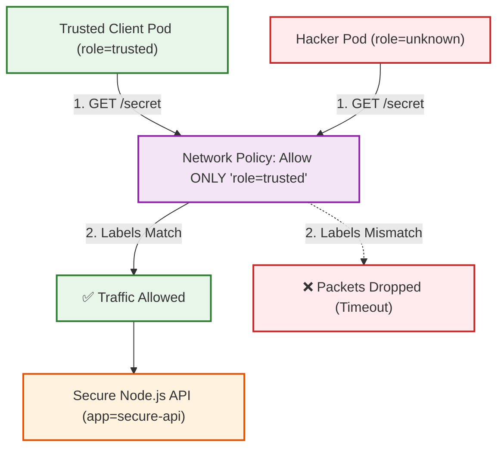

# Definition & Scenario

## Network Policies (The Internal Firewall)
- Why we use it: To enforce Zero-Trust architecture. If a hacker breaches a front-facing web container, a flat network allows them to easily run internal port scans and extract data from backend databases. Network Policies act as a firewall at the Pod IP level, blocking all unauthorized internal traffic.
- Real-world Scenario: You have a 3-tier application: A React Frontend, a Node.js Backend API, and a PostgreSQL Database. You write a Network Policy that says: "The Database can ONLY accept traffic from the Backend API." If a hacker compromises the React Frontend and tries to ping the Database directly, the network drops the packets silently.

## Mermaid Architecture



## End-to-End Testing Playbook

```warning
CNI Requirement
Network Policies require a networking plugin (CNI) like Calico to function. From our previous sessions, your Minikube is already running Calico, so this will work perfectly! (Standard Minikube ignores these rules).
```
### The Diagnosis: The Missing Police Officer -- faced one issue
Notice how when you applied the YAML, Kubernetes happily responded: networkpolicy... created (or unchanged).

The Kubernetes API Server will gladly accept and save your Network Policy, but Kubernetes itself does not enforce network traffic. That job belongs to the CNI (Container Network Interface) plugin running inside your cluster.

By default, Minikube uses a very basic network plugin that is designed to be lightweight. It completely ignores Network Policies. You essentially passed a law, but there are no police officers in the cluster to enforce it, so the hacker pod just walked right through!

### The Fix: Install a True CNI (Calico)
To make Network Policies work, we must reboot our Minikube cluster and install a production-grade CNI like Calico. Calico acts as the internal firewall and will actively enforce the rules we write.

Here is the exact playbook to reboot your environment with Calico and prove the firewall works.

1. Rebuild the Cluster with Calico:
Wipe the slate clean.
We need to delete the unprotected cluster and start a fresh one with Calico enabled.
```Bash
minikube delete
minikube start --cni=calico
```
Wait a minute for the cluster to boot. Calico is heavy, so it might take an extra 30 seconds.

2. Re-Load the Image:
The necessary chore.
Because we created a new cluster, its Docker cache is empty. Rebuild and load the secure API image.
```Bash
eval $(minikube docker-env -u)
docker build -f Dockerfile.netpol -t netpol-api:v1 .
minikube image load netpol-api:v1
```
3. Apply App and Firewall:
Deploy everything.
Deploy both the Node.js API and the Network Policy simultaneously.
```Bash
kubectl apply -f secure-app.yaml
kubectl apply -f netpol-firewall.yaml
```
4. Hack the API:
The Blocked Attack.
Now that Calico is watching the network, spawn the untrusted hacker pod and try to steal the data:
```Bash
kubectl run hacker-pod --rm -i --tty --image=alpine -- sh
```
Inside the hacker shell:
```Bash
apk add --no-cache curl
curl --connect-timeout 5 http://secure-svc/secret
```
The Result: It will freeze! Calico sees the packets, notices the hacker pod doesn't have the role=trusted-client label, and drops the traffic. You will get a Connection timed out error. Type exit to leave.

5. Spawn the Trusted Client:
The VIP Pass.
Now spawn the pod with the exact label required by the Network Policy:
```Bash
kubectl run trusted-pod --labels="role=trusted-client" --rm -i --tty --image=alpine -- sh
Inside the trusted shell:Bashapk add --no-cache curl
curl -s http://secure-svc/secret
```
The Ultimate Proof: The request goes straight through, returning the top-secret JSON data!