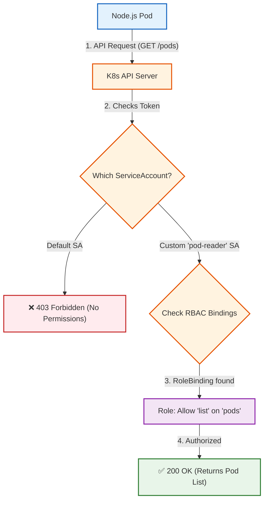

# ServiceAccounts (Machine Identity)
When a human types kubectl get pods, the API server knows who you are based on your cloud credentials or certificates. But what happens when an automated Pod (like a Jenkins CI/CD runner or a Prometheus metrics scraper) needs to talk to the Kubernetes API?
- The Problem: Pods need a way to prove their identity to the cluster.
- The Solution: ServiceAccounts. A ServiceAccount is exactly what it sounds like—an identity specifically created for machines.
- The Default Danger: If you don't specify a ServiceAccount in your deployment YAML, Kubernetes automatically assigns the default ServiceAccount to your pod. Best practice dictates you should always create a custom, restricted ServiceAccount for every application.

# RBAC (Role-Based Access Control)
Once a Pod has an identity (a ServiceAccount), Kubernetes needs to know what that identity is legally allowed to do. This is handled by RBAC, which links an identity to a set of permissions.
It is broken down into two parts:
- The Rulebook (Role / ClusterRole): A YAML file that explicitly lists permitted actions. For example, a Role might say: "Can get and list Pods, but cannot delete them."
- The Handcuffs (RoleBinding / ClusterRoleBinding): A YAML file that attaches the Rulebook to a specific User or ServiceAccount.
- Scope matters: A Role only grants permissions within a specific namespace. A ClusterRole grants permissions globally across the entire cluster.

# Definition & Scenario
## ServiceAccounts (Machine Identity)
- Why we use it: To give a Pod a verifiable identity so it can securely authenticate with the Kubernetes API Server without hardcoding human passwords or cloud tokens.
- Real-world Scenario: You are building an internal developer dashboard, a custom CI/CD runner, or a monitoring tool (like Prometheus). This application needs to query the Kubernetes API to ask: "What pods are currently running in the default namespace?" By default, Kubernetes blocks this request (HTTP 403 Forbidden). We must create a specific ServiceAccount, write a Role that grants permission to "list pods," and bind them together.

## Mermaid Architecture



## End-to-End Testing Playbook
We are going to deploy the app, prove that the default state is securely locked down, and then apply our RBAC patch to unlock it.
1. Compile and Load:
Build the image.
Ensure your terminal points to your local machine, build the image, and deliver it to Minikube.
```Bash
eval $(minikube docker-env -u)
docker build -f Dockerfile.sa -t sa-poc-api:v1 .
minikube image load sa-poc-api:v1
```
2. Apply Application YAML:
Deploy the baseline.
Apply the application deployment without any custom security rules.
```Bash
kubectl apply -f app-deployment.yaml
```
3. Open the Tunnel:
Connect to the app.
In a second terminal window, open a port-forward connection:
```Bash
kubectl port-forward svc/sa-poc-svc 8080:80
```
4. Test the Default State:
The Security Block.
In your first terminal, test the endpoint. The Node.js app will grab its default token and attempt to call the Kubernetes API.
```Bash
curl http://localhost:8080/list-pods
```
The Result: You will get a 403 Forbidden error. Kubernetes successfully defended itself against an unauthorized pod trying to read cluster data!
5. Apply the RBAC Manifest:
Define the rules.
Apply the security file containing the ServiceAccount, Role, and RoleBinding.
```Bash
kubectl apply -f rbac-security.yaml
```
6. Patch the Deployment:
Attach the Identity.
Now, instruct Kubernetes to swap the pod's identity from default to our newly authorized pod-reader-sa.
```Bash
kubectl set serviceaccount deployment/sa-poc-deployment pod-reader-sa
```
Note: Changing a ServiceAccount forces Kubernetes to terminate the old pod and spin up a new one so it can mount the new cryptographic token inside it.7.Test the Authorized State:The Ultimate Proof.Because the pod was recreated, your port-forward connection dropped. Restart it in the second terminal:
```Bash
kubectl port-forward svc/sa-poc-svc 8080:80
```
Now, hit the endpoint one final time:Bashcurl http://localhost:8080/list-pods
The Payoff: You will receive a 200 OK JSON response containing an array of every pod currently running in your default namespace. Your machine identity is officially authenticated!
