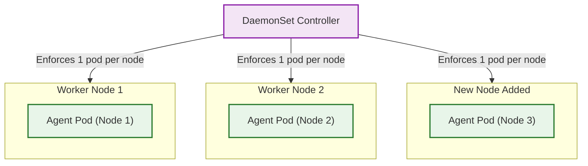

# DaemonSets

### Definition & Scenario

- Why we use it: A DaemonSet guarantees that a copy of a pod runs on every single worker node in the cluster. If you add 5 new worker nodes to your cluster tomorrow, the DaemonSet controller automatically deploys a pod onto those 5 new nodes without any manual scaling.
- Real-world Scenario: Cluster-wide log collectors (Fluentd, Logstash), infrastructure monitors (Datadog Agent, Prometheus Node Exporter), or networking daemons (kube-proxy, Calico).

### Mermaid Architecture


## Faced one issue follow old step
You have hit a very deep, fundamental networking issue in local Kubernetes clusters. The output you provided from kubectl describe node minikube-m02 and the minikube node add command tells the entire story.Let's dissect this autopsy report like a Principal Engineer.
- The Smoking Guns (The Autopsy)
 - Clue 1: The Condition StatusLook at the Conditions section in your describe node output:Ready    False ... KubeletNotReady ... container runtime network not ready: NetworkReady=false reason:NetworkPluginNotReady message:docker: network plugin is not ready: cni config uninitialized
 - Clue 2: The Minikube WarningLook at the output when you ran minikube node add:❗ Cluster was created without any CNI, adding a node to it might cause broken networking.
## The Diagnosis: The Missing CNI(issue)
Your second node is perfectly healthy hardware-wise. The reason it is stuck in NotReady is because it has no network.
In Kubernetes, worker nodes cannot talk to each other out of the box. They require a CNI (Container Network Interface) plugin—like Flannel, Calico, or Cilium—to create a virtual mesh network across the nodes.
When you initially ran minikube start yesterday, you didn't explicitly tell it to install a CNI plugin because Minikube's single-node setup doesn't strictly need one. But the moment you added a second node, the new node booted up, looked around for a network plugin to connect to the master, found nothing (cni config uninitialized), and threw its hands up in a NotReady state.

## The Fix: Rebuilding with a Network Plugin
You cannot easily hot-swap a core network plugin onto an existing, running, multi-node cluster. The standard DevOps practice here is to burn the cluster down and rebuild it with the correct networking architecture from the start.Here is your playbook to build a true, networked, multi-node cluster:

1. Delete the Broken Cluster:
Burn it down.
Wipe the slate clean.
```Bash
minikube delete
```
2. Start with a CNI:The Architectural Fix.This time, when we start the cluster, we will explicitly tell Minikube to provision two nodes and install the calico network plugin. Calico is the industry standard CNI for Kubernetes networking.
```Bash
minikube start --nodes 2 --cni calico
```
Note: This might take a minute or two as it downloads the Calico components.

3. Check Node Status:
Verify the Network.
Once it finishes, check the nodes. You might have to wait 30-60 seconds for Calico to fully initialize.
```Bash
kubectl get nodes -w
```
You will see both minikube and minikube-m02 transition to Ready because they can finally talk to each other over the Calico network!

4. Test the Workload:
Redeploying the DaemonSet.
Because we deleted the cluster, you will need to re-load your image and apply the DaemonSet YAML again:

```Bash
eval $(minikube docker-env -u)
docker build -f Dockerfile.daemon -t daemon-agent:v1 .
minikube image load daemon-agent:v1
kubectl apply -f daemonset.yaml
```
5. Check the Pods:The Ultimate Proof.
```Bash
kubectl get pods -l name=node-monitor -o wide
```
You will now see two pods perfectly distributed across your two healthy nodes.

6. Test the DaemonSet Auto-Scaling:
To truly test a DaemonSet, we need more nodes. Let's add a second node to Minikube:
```Bash
minikube node add
```
Check your pods again (kubectl get pods). Without you changing any configuration, the DaemonSet Controller automatically saw the new node and spawned a second agent pod onto it!

```Bash
kubectl get pods -l name=node-monitor -o wide
```