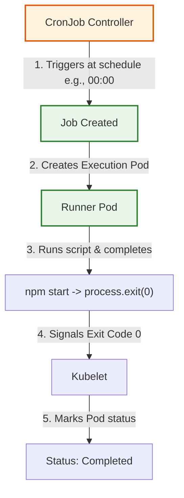

# Jobs & CronJobs
## Definition & Scenario
- Jobs (One-off Task): Runs containers until they successfully terminate (exit 0). Unlike Deployments, which restart stopped containers thinking they crashed, a Job expects the process to stop.
  - Real-world Scenario: Database schema migrations during deployment, video processing pipeline, bulk data imports.
- CronJobs (Scheduled Tasks): Manages Jobs on a time-based schedule (Cron format).
  - Real-world Scenario: Daily database backups at 02:00 AM, hourly email digest generation, periodic cleanup of expired session tokens.

## Mermaid Architecture



## End-to-End Playbook

1. Build the Image:
```Bash
eval $(minikube docker-env)
docker build -f Dockerfile.batch -t batch-runner:v1 .
```
2. Test the One-Off Job:
Apply your jobs.yaml file (which contains both the Job and the CronJob).
```Bash
kubectl apply -f jobs.yaml
```
Watch the Job execute. You will see it go from Running to Completed:
```Bash
kubectl get pods -w
```
3. Verify Job Success:
Once it says Completed, check the logs of the terminated pod to prove it ran your code successfully:
```Bash
kubectl logs job/db-migration-job
```
4. Monitor the CronJob:
Because we set the CronJob to run every 5 minutes (*/5 * * * *), you can check its status using:
```Bash
kubectl get cronjobs
```
This will show you when it was last scheduled. If you leave your cluster running, run kubectl get jobs in 5 minutes and you will see a dynamically generated Job (with a random timestamp in its name) spawned by this CronJob.