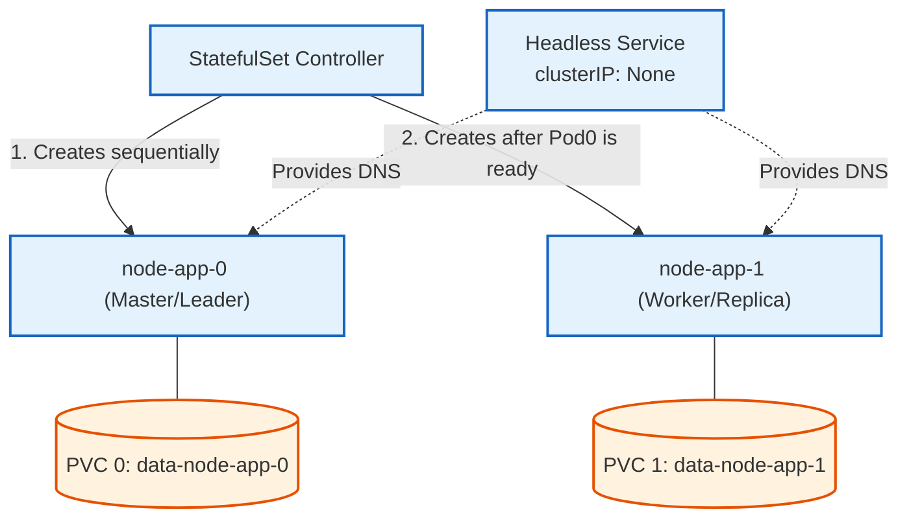

# StatefulSets

## Definition & Scenario

1. Why we use it: A standard Deployment creates anonymous, interchangeable pods with random names (e.g., app-59c4796b87-djxj4). If a pod dies, its replacement gets a brand-new IP and name. A StatefulSet provides ordinal indexes (0, 1, 2), sticky network IDs, and dedicated persistent storage per pod.

2. Real-world Scenario: Distributed databases (MongoDB, PostgreSQL, Cassandra), message brokers (Kafka, RabbitMQ), or Node.js stateful clusters with leader election.

3. Key Feature: Pod stateful-node-0 will always keep its exact name, hostname, and its own attached PersistentVolume, even if it crashes and gets rescheduled.



## End-to-End Playbook
1. Build the Image:Connect to Minikube's Docker daemon and build the image:
```Bash
eval $(minikube docker-env)
docker build -f Dockerfile.stateful -t stateful-app:v1 .
```
2. Apply the Manifest:Apply your statefulset.yaml file:
```Bash
kubectl apply -f statefulset.yaml
```
3. Watch the Sequential Startup:Run this watch command immediately. You will see node-app-0 start. node-app-1 will not start until node-app-0 is completely ready.
```Bash
kubectl get pods -w
```
4. Test the Storage Persistence:Delete the first pod to simulate a node crash:
```Bash
kubectl delete pod node-app-0
```
Now watch the pods again (kubectl get pods). You will see Kubernetes recreate it. Notice that it is still named node-app-0 (unlike a Deployment which generates a new random hash) and it automatically reattaches to its exact same data volume!
