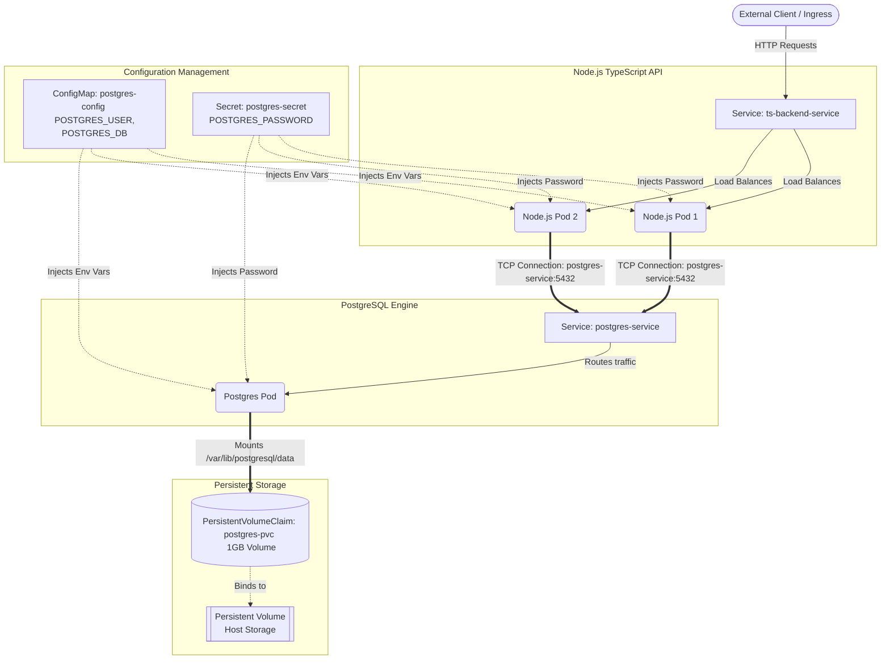
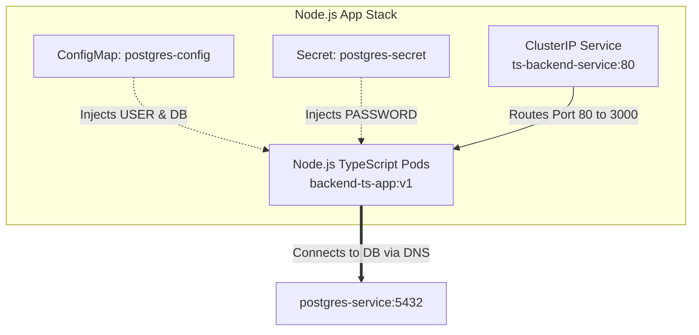

# Phase 4: Configuration & Storage POC (Node.js TypeScript + PostgreSQL)

This directory demonstrates how to run a stateful application in Kubernetes using **ConfigMaps**, **Secrets**, and **Persistent Volume Claims (PVC)**.

## Architecture Overview & Data Flow


# backend-deployment.yaml flow diagram


# Step-by-Step Deployment Instructions
1. Build the Node.js TypeScript Image in Minikube
```Bash
# Navigate to the TypeScript app folder
cd backend-ts-poc

# Load image into Minikube (Foolproof method)
docker build -t backend-ts-app:v1 .
minikube image load backend-ts-app:v1
```

2. Apply Kubernetes Manifests
Run the files in order to build the infrastructure layers:

```Bash
# Step A: Create ConfigMap & Secret
kubectl apply -f db-config.yaml

# Step B: Request Storage (PVC)
kubectl apply -f db-storage.yaml

# Step C: Deploy PostgreSQL Database & Internal Service
kubectl apply -f db-deployment.yaml

# Step D: Deploy TypeScript Node.js Backend API
kubectl apply -f backend-deployment.yaml
```
Verification & Chaos Testing
## Step 1: Verify All Resources Are Bound and Running
```Bash
kubectl get pvc
```
# Status MUST show 'Bound'

kubectl get pods
# Output should show 2 backend pods and 1 postgres pod in 'Running' status
## Step 2: Test API Data Insertion
Port-forward the TypeScript API to your local machine:

```Bash
kubectl port-forward svc/ts-backend-service 8080:80
```
Insert a test user into PostgreSQL via HTTP:

```Bash
curl -X POST http://localhost:8080/users \
  -H "Content-Type: application/json" \
  -d '{"name": "Principal DevOps Engineer"}'
Query users:
```

```Bash
curl http://localhost:8080/users
```
## Step 3: The Ultimate Chaos Test (Proving Storage Persistence)
Delete the PostgreSQL pod completely:

```Bash
kubectl delete pod -l app=postgres
```
Wait a few seconds for the Deployment to recreate the Pod. Once running, execute the curl query again:

```Bash
curl http://localhost:8080/users
```
Result: The data remains intact because PostgreSQL re-attached to the existing postgres-pvc volume!
