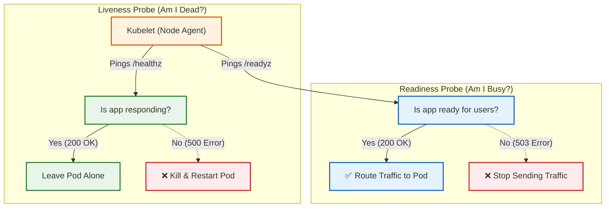

# Liveness vs. Readiness Probes.

## Definitions & Scenarios
### Liveness Probe (The Survival Check)
- Definition: "Is the application dead or frozen?" If this probe fails, the Kubelet aggressively kills and restarts the container.
- Real-World Scenario: You have a Java application. It encounters a massive data error, runs out of memory, and enters a permanent infinite loop or "deadlock." The process hasn't crashed (so Kubernetes thinks it's fine), but it is completely unresponsive. The Liveness Probe detects the freeze and restarts the pod to clear the bad state.

### Readiness Probe (The Traffic Check)
- Definition: "Is the application currently able to handle user requests?" If this probe fails, Kubernetes temporarily removes the pod from the Service load balancer, stopping traffic from reaching it. It does not kill the pod.
- Real-World Scenario: Your Node.js app boots up instantly, but it needs 15 seconds to download a massive Redis cache before it can answer user queries. If users hit it during those 15 seconds, they get errors. The Readiness Probe tells Kubernetes to wait until the cache is loaded before sending it traffic. It is also used if the app gets temporarily overwhelmed and needs a breather to catch up.

## Architecture Flow (Liveness vs. Readiness)

## End-to-End Testing Playbook
1. Build & Load Image:
Bypass ErrImageNeverPull.
Ensure your terminal points to your local machine, build the image, and deliver it to Minikube's cache.
```Bash
eval $(minikube docker-env -u)
docker build -f Dockerfile.probes -t probes-api:v1 .
minikube image load probes-api:v1
```
2. Deploy & Watch Readiness:
Observe the Boot Sequence.
Apply the YAML and immediately run the watch command.
```Bash
kubectl apply -f probes-poc.yaml
kubectl get pods -w
```
Watch closely: The pod will show STATUS: Running, but READY will be 0/1! Why? Because our Node.js code takes 15 seconds to "load the cache." After 15 seconds, the Readiness probe will succeed, and READY will flip to 1/1. Press Ctrl+C to exit the watch.
3. Check the Endpoints:
Verify Traffic.
A Service uses Readiness Probes to determine who gets traffic. Run this:
```Bash
kubectl get endpoints probes-svc
```
You will see an IP address listed under ENDPOINTS. Traffic is flowing safely!
4. Port-Forward:
Open the tunnel.
In a second terminal window, open a tunnel so we can press the kill switches.
```Bash
kubectl port-forward svc/probes-svc 8080:80
```
5. Break the Readiness Probe:
The Bouncer.
In your first terminal, pull the Readiness kill switch:
```Bash
curl http://localhost:8080/break-readiness
```
Immediately run the endpoints command again:
```Bash
kubectl get endpoints probes-svc
```
The Proof: The IP address is gone! The endpoint is <none>. Kubernetes detected the app was "busy", and pulled it from the load balancer to protect users. If you wait 30 seconds and check again, the IP will magically reappear.
6. Break the Liveness Probe:
The Executioner.
Now, let's simulate a permanent deadlock/freeze. Hit the Liveness kill switch:
```Bash
curl http://localhost:8080/break-liveness
```
Run kubectl get pods -w. Within about 10-15 seconds, Kubernetes will realize the app is brain-dead and ruthlessly execute it. You will see the RESTARTS count jump from 0 to 1 as K8s spins up a fresh, healthy container to save the day!