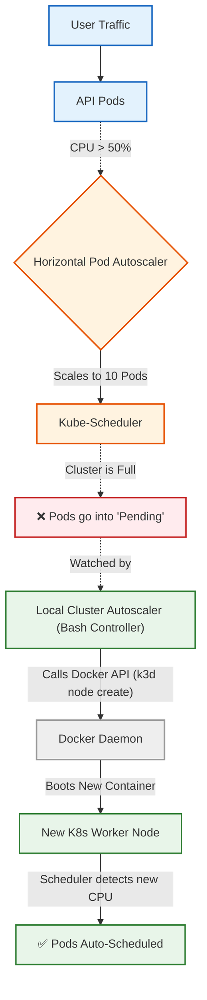

This is the ultimate test of a DevOps engineer. You are asking how to bridge the gap between Kubernetes (the software orchestrator) and the underlying physical infrastructure (the hardware).

First, let's address your question about kind (Kubernetes IN Docker).

The Principal Engineer Truth About kind
You cannot easily use kind for Cluster Autoscaler testing.
By design, kind generates a static configuration file when the cluster boots. Once a kind cluster is running, you cannot dynamically add new nodes to it. It is a closed system.

To test true Cluster Autoscaling locally, we must switch to k3d (K3s in Docker). k3d is a lightweight, highly dynamic local cluster tool that acts exactly like a cloud provider—it allows you to add and remove nodes on the fly while the cluster is running.

Here is your Principal Engineer POC for a Fully Automated Auto-Scaling Pipeline running locally. We are going to build a "Micro-Autoscaler" that simulates exactly what AWS Karpenter or GCP Cluster Autoscaler does.

## Local Auto-Provisioning (The k3d CA Simulation)
### Definition & Scenario
Why we use it: The official Kubernetes cluster-autoscaler requires a Cloud API (like AWS EC2) to request new virtual machines. Because your laptop isn't AWS, we will run a lightweight controller script that watches the Kubernetes API for Pending pods, and when it sees them, it sends an API call to your local Docker Daemon to spin up a new hardware node.

Real-world Scenario: This exactly mimics how node provisioners like AWS Karpenter work. Karpenter watches for unschedulable pods, calculates the required CPU, and dynamically boots exactly the right EC2 instance to fit them.

### Mermaid Architecture


## End-to-End Testing Playbook
This playbook will set up the dynamic k3d cluster, deploy the CPU-hungry app from our last session, generate traffic, and prove that the entire system (Pods + Hardware) scales completely hands-free.

1. Install k3d & Create Cluster:
Swap orchestrators.
If you don't have k3d installed, install it (e.g., brew install k3d on Mac). Then, create a tiny 1-node cluster:
```Bash
# Stop minikube to free up RAM
minikube stop 
# Create a dynamic k3d cluster with the Metrics Server enabled
k3d cluster create autoscale-cluster --agents 1 --k3s-arg "--disable=traefik@server:0"
```
2. Build and Load Image:
Prepare the workload.
Ensure your terminal is using your local Docker, build the image (from the Dockerfile.autoscale we used previously), and inject it into k3d.
```Bash
docker build -f Dockerfile.autoscale -t autoscale-api:v1 .
k3d image import autoscale-api:v1 -c autoscale-cluster
```
3. Apply the Workload:Deploy the HPA logic.Deploy the exact same auto-scale.yaml from our last session (Deployment, Service, and HPA).
```Bash
kubectl apply -f auto-scale.yaml
```
Wait a minute and run kubectl get hpa to ensure it is reading CPU metrics (it should show 0%/50%).

4. Start the Cluster Autoscaler:
The Brains of the Operation.
Open a second terminal window and run the bash script we just created. Leave it running in the background. It will act as your cloud provisioner.
```Bash
./local-autoscaler.sh
```
5. Trigger the Traffic Spike:
Black Friday.
Open a third terminal window and run the load generator to artificially spike the CPU on your Node.js app:
```Bash
kubectl run -i --tty load-generator --rm --image=alpine -- sh -c "apk add --no-cache curl && while true; do curl -s http://autoscale-svc/burn;sleep 0.1; done"
```
6. Observe the Magic:
Watch the Automation.
Go back to your main terminal and watch the cluster:
```Bash
kubectl get pods -o wide -w
```
Here is exactly what you will watch happen, hands-free:
- The HPA detects the CPU spike and requests 10+ new pods.
- Because your Deployment requests high CPU (1000m), the single k3d node fills up instantly.
- The remaining pods fall into Pending.
- Your local-autoscaler.sh terminal will light up, detecting the Pending pods.
- The script issues a command to Docker to spin up worker-1.
- As soon as worker-1 boots, you will see the Pending pods transition to Running on the new node.
You just built and observed a complete, two-tiered cloud auto-scaling architecture entirely on your local machine.

## Minikube vs. k3d: The Principal Engineer's Guide
You have now used the two most popular local Kubernetes tools in the industry. As a DevOps engineer, you must know when to use which.
Core Architecture Differences
- Minikube: Backed by Google. It is a "heavyweight" tool designed to mimic a traditional, full-scale Kubernetes cluster. It usually spins up a full Virtual Machine (or a very heavy Docker container) to host the cluster. It includes every standard K8s component, making it heavier on RAM and slower to boot, but highly accurate for standard K8s testing.
- k3d: Backed by SUSE/Rancher. It is a wrapper around k3s, which is a stripped-down, highly optimized, IoT-ready version of Kubernetes. k3d runs the entire cluster purely inside standard Docker containers. Because it strips out heavy legacy code, it boots in seconds, uses minimal RAM, and handles dynamic multi-node architectures flawlessly.

### Feature Comparison: Minikube vs. k3d

| Feature | Minikube | k3d (k3s in Docker) |
| :--- | :--- | :--- |
| **Primary Use Case** | Beginners, learning standard K8s components | CI/CD pipelines, rapid multi-node testing |
| **Boot Time** | Slower (1-3 minutes) | Blazing Fast (10-20 seconds) |
| **Resource Usage** | Heavy (runs a full VM/heavy container) | Very Light (runs optimized containers) |
| **Multi-Node Networking** | Clunky (Requires explicit CNI like Calico) | Flawless (Natively handles container networks) |
| **Image Delivery** | `minikube image load` (or `docker-env`) | `k3d image import` |
| **Autoscaling Testing** | Hard (Node routing often gets confused) | Easy (Instantly boots new Docker containers) |

Here is a side-by-side comparison of the daily commands you will use for both tools.
1. Creating a ClusterMinikube:
```Bash
# Single node (Default)
minikube start
# Multi-node (Requires CNI plugin for networking to work)
minikube start --nodes 3 --cni calico
```
k3d:
```Bash
# Creates a cluster with 1 control plane and 2 worker nodes (agents) instantly
k3d cluster create my-cluster --servers 1 --agents 2
```
2. Managing Worker Nodes (Hardware)
Minikube:
```Bash
minikube node add                 # Adds a new node
minikube node list                # Lists all nodes
minikube node delete minikube-m02 # Deletes a specific node
```
k3d:
```Bash
k3d node create worker-3 --cluster my-cluster --role agent  # Adds a new node
k3d node list                                               # Lists all nodes
k3d node delete k3d-my-cluster-agent-2                      # Deletes a specific node
```
3. Getting Local Docker Images into the Cluster
Minikube:
```Bash
minikube image load my-app:v1
```
k3d:
```Bashk3d image import my-app:v1 -c my-cluster
```
4. Pausing and Deleting the Cluster
Minikube:
```Bash
minikube stop     # Pauses the cluster (saves state)
minikube delete   # Completely destroys the cluster
```
k3d:
```Bash
k3d cluster stop my-cluster    # Pauses the cluster
k3d cluster delete my-cluster  # Completely destroys the cluster
```
The Industry Standard: In modern DevOps teams, Minikube is used for onboarding juniors and testing complex add-ons (like Service Meshes). k3d is the industry standard for running automated integration tests in CI/CD pipelines (like GitHub Actions) because it is so fast and lightweight.