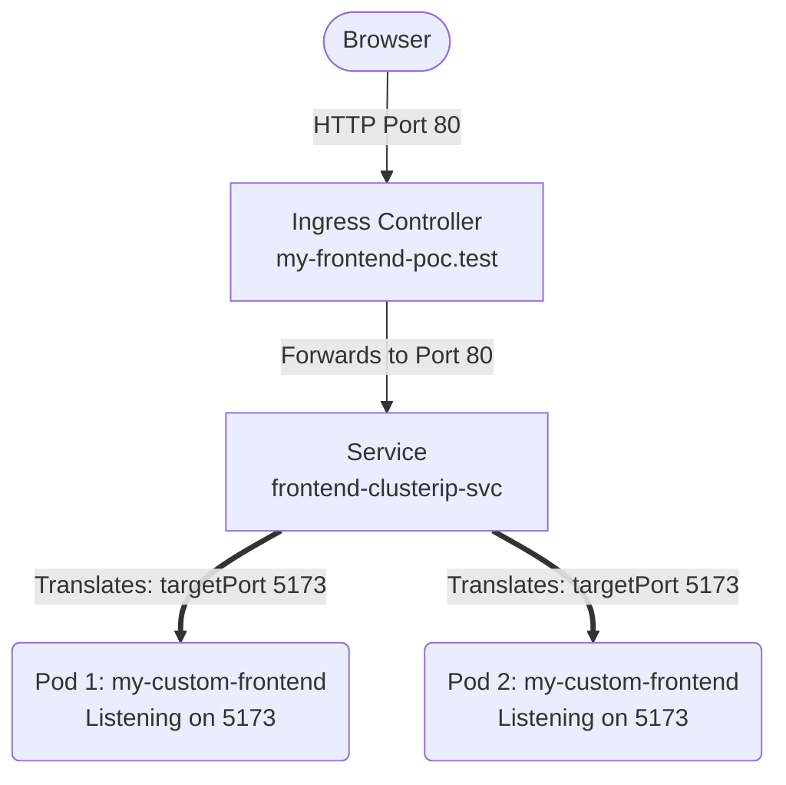

```mermaid
graph TD
    %% Traffic hits the cluster
    User([Browser]) -->|HTTP Port 80| Ingress[Ingress Controller <br/> my-frontend-poc.test]
    
    %% Ingress routes to Service
    Ingress -->|Forwards to Port 80| SVC[Service <br/> frontend-clusterip-svc]
    
    %% Service translates and routes to Pods
    SVC ==>|Translates: targetPort 5173| Pod1(Pod 1: my-custom-frontend <br/> Listening on 5173)
    SVC ==>|Translates: targetPort 5173| Pod2(Pod 2: my-custom-frontend <br/> Listening on 5173)
```
