# Network Architectures Compared

```mermaid
graph TD
    classDef svc fill:#e3f2fd,stroke:#1565c0,stroke-width:2px;
    classDef pod fill:#f3e5f5,stroke:#8e24aa,stroke-width:2px;
    classDef ext fill:#fff3e0,stroke:#e65100,stroke-width:2px;
    classDef node fill:#e8f5e9,stroke:#2e7d32,stroke-width:2px;

    subgraph Scenario 1: NodePort
        Ext1[External Client]:::ext --> |"Hits Port 32000"| Node1[Worker Node IP]:::node
        Node1 --> |"Routes to"| Svc1[Service: NodePort]:::svc
        Svc1 --> |"Round Robin"| P1A[Pod A]:::pod
        Svc1 --> |"Round Robin"| P1B[Pod B]:::pod
    end

    subgraph Scenario 2: LoadBalancer
        Ext2[External Client]:::ext --> |"Hits Cloud IP"| LB[Cloud LoadBalancer]:::ext
        LB --> |"Routes to"| Svc2[Service: LoadBalancer]:::svc
        Svc2 --> |"Round Robin"| P2A[Pod A]:::pod
        Svc2 --> |"Round Robin"| P2B[Pod B]:::pod
    end

    subgraph Scenario 3: Headless Service
        InternalClient[Internal Pod]:::ext -.-> |"1. DNS Query for Service Name"| Svc3[Headless Service\nclusterIP: None]:::svc
        Svc3 -.-> |"2. Returns exact IPs of all Pods"| InternalClient
        InternalClient --> |"3. Connects Directly"| P3A[Pod IP: 10.244.0.5]:::pod
        InternalClient --> |"3. Connects Directly"| P3B[Pod IP: 10.244.0.6]:::pod
    end
```


### The Breakdown
- NodePort: Opens a port on your host machine's firewall. Traffic hits the node, goes to the Service, and the Service load-balances it to a random Pod.
- LoadBalancer: Provisions a physical/cloud Load Balancer (like AWS ELB). Traffic hits the ELB, goes to the Service, and the Service load-balances it to a random Pod.
- Headless Service: Does not load balance. It does not even have an IP address (clusterIP: None). Instead, it acts purely as a dynamic DNS record. When you query it, it gives you a raw list of every individual Pod's IP address, allowing you to choose exactly which one you want to talk to.

## Headless Service: Definition & Scenarios
- Why we use it: Standard services hide your pods behind a single virtual IP. But in advanced distributed systems, pods need to know about each other. A Headless Service asks the Kubernetes DNS server to return the direct A records (IP addresses) of the backing pods.
- Real-world Scenarios:
    1. Databases (MongoDB, Cassandra, Redis): The primary node needs to replicate data to the secondary nodes. It cannot just send data to a random load balancer; it must connect directly to replica-1 and replica-2.
    2. Peer-to-Peer Networks: Blockchain nodes or clustered cache systems (like Hazelcast) where every node needs to form a mesh network with every other node.

## End-to-End Testing Playbook
To test this, we won't use a browser. We will spin up a temporary "Swiss Army Knife" pod inside the cluster to act as another internal microservice trying to talk to our peer network.
1. Build the Image:
Connect to Minikube.
Ensure you are using the single-node Minikube setup from our last lesson, wire up your terminal, and build the image.
```Bash
eval $(minikube docker-env)
docker build -f Dockerfile.headless -t peer-finder:v1 .
```
2. Apply the Manifest:
Deploy infrastructure.
Deploy the Headless Service and the 3-replica Deployment.
```Bash
kubectl apply -f headless.yaml
```
Wait until all 3 pods are running:
```Bash
kubectl get pods
```
3. Verify the Pod IPs:
DNS Verification.
Before we test the app, let's see what IP addresses Kubernetes assigned to the 3 pods. Use -o wide to show the IPs.
```Bash
kubectl get pods -o wide -l app=peer-finder
```
Write down or remember the IPs you see (e.g., 10.244.0.10, 10.244.0.11).
4. Launch a Debug Pod:
Spinning up a test client.
We will launch a temporary, interactive Alpine Linux pod inside the cluster. This simulates another microservice trying to discover your app.
```Bash
kubectl run -i --tty --rm debug-pod --image=alpine -- sh
```
(You are now inside a terminal running inside the cluster!)
5. Test the Headless Service:
The Ultimate Proof.
First, install curl inside your debug pod:
```Bash
apk add --no-cache curl
```
Now, ping the API. Instead of hitting an IP, we use the internal DNS name of the service: headless-svc.
```Bash
curl http://headless-svc/discover
```
but getting error "curl: (7) Failed to connect to headless-svc:80 after 187 ms: Could not connect to server" in terminal

- solution:
The Diagnosis: Why curl failed
When you created a standard NodePort or LoadBalancer Service, Kubernetes deployed kube-proxy rules to intercept traffic on port 80 and secretly translate it to your container's port 3000.

But a Headless Service explicitly disables kube-proxy interception.

Here is what happened when you typed curl http://headless-svc/discover:
- curl asked CoreDNS for the IP of headless-svc.
- CoreDNS returned the raw IP addresses of your 3 pods (e.g., 10.244.0.5).
- Because you used http://, curl defaulted to asking for Port 80.
- It tried to connect to 10.244.0.5:80.
- Your Node.js app is only listening on Port 3000, so the pod immediately rejected the connection!

The Fix
Because there is no load balancer doing port translation for you, you must bypass port 80 and hit the container's raw port exactly as it is defined in your Node.js code.

Run this command in your debug pod instead:

```Bash
curl http://headless-svc:3000/discover
```
Bonus Proof:
If you want to see the Headless Service DNS magic with your own eyes, run this command in your Alpine debug pod:

```Bash
nslookup headless-svc
```
Instead of returning a single Kubernetes Virtual IP, it will print out the exact A-records (IP addresses) of all 3 of your peer-finder pods!

## Hit these "http://localhost:8080/discover" api from postman

If you want to hit that /discover endpoint from your local machine (using Postman or your browser) instead of an internal debug pod, we face a fundamental networking problem.
The Problem: Why you can't reach it right now
You deployed a Headless Service (clusterIP: None). Headless Services are purely internal. They do not allocate a port on your Minikube node (like NodePort) and they do not create an external IP (like LoadBalancer). They only provide DNS resolution for pods inside the cluster.To hit it from your laptop, you need a bridge.
The Solution: kubectl port-forward
As a DevOps engineer, when you need to quickly debug a purely internal application from your local machine, you use port-forward. This command creates a secure, temporary tunnel from a port on your laptop directly into the cluster.
Here is the exact playbook to test it in Postman.
1. Get the Service Name:
Find the target.
Verify your Headless Service is running:
```Bash
kubectl get svc headless-svc
```
2. Start the Port-Forward:
Create the tunnel.Run this command in your terminal. It tells Kubernetes: "Take port 8080 on my laptop, and tunnel it directly to port 80 on headless-svc inside the cluster."
```Bash
kubectl port-forward svc/headless-svc 8080:80
```
Note: This command runs in the foreground. Leave this terminal window open. If you close it or press Ctrl+C, the tunnel collapses.

### while execute 2 (Step) we faced one Error

```error
Handling connection for 8080
E0903 11:03:15.481920   68624 portforward.go:522 "Unhandled Error" err=<
    an error occurred forwarding 8080 -> 80: error forwarding port 80 to pod d3ececc08d24f13725d87d244574d39aef152885bef38c856868549159176b00, uid : exit status 1: 2026/09/03 05:33:15 socat[36918] E connect(5, AF=2 127.0.0.1:80, 16): Connection refused
 > 
```
### solution
Ah, you caught a classic Kubernetes Catch-22! I steered you right into a strict validation trap.

Here is exactly what just happened:
- When you run kubectl port-forward svc/..., the kubectl CLI tool strictly checks your Service YAML before it does anything.
- It looks at your YAML, sees port: 80, and says: "Wait, you asked for port 3000, but this Service only defines port 80. Denied!"
- But as we saw in the first error, if you do ask for port 80, it tunnels to port 80 on the Pod, which rejects the connection because Node.js is listening on 3000!

The Principal Engineer Fix: Bypass the Service
When a Headless Service gets in the way of debugging, we simply bypass it and port-forward directly to the Deployment instead. This ignores the Service's strict port rules and goes straight to the raw container.

Run this command:

```Bash
kubectl port-forward deployment/peer-finder-deployment 8080:3000
```
Why this works perfectly:
By changing svc/headless-svc to deployment/peer-finder-deployment, kubectl finds one of the running pods belonging to that deployment and tunnels your laptop's 8080 directly into the pod's container port 3000. No Service validation, no translation errors.

Now, go hit http://localhost:8080/discover in Postman!