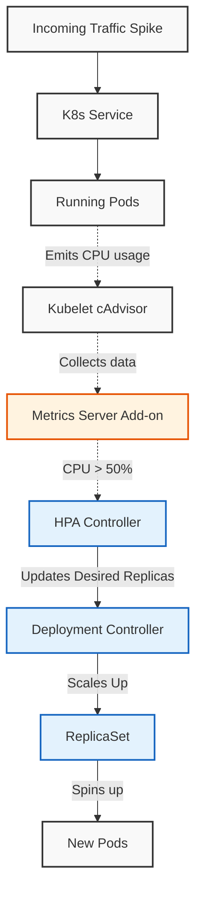
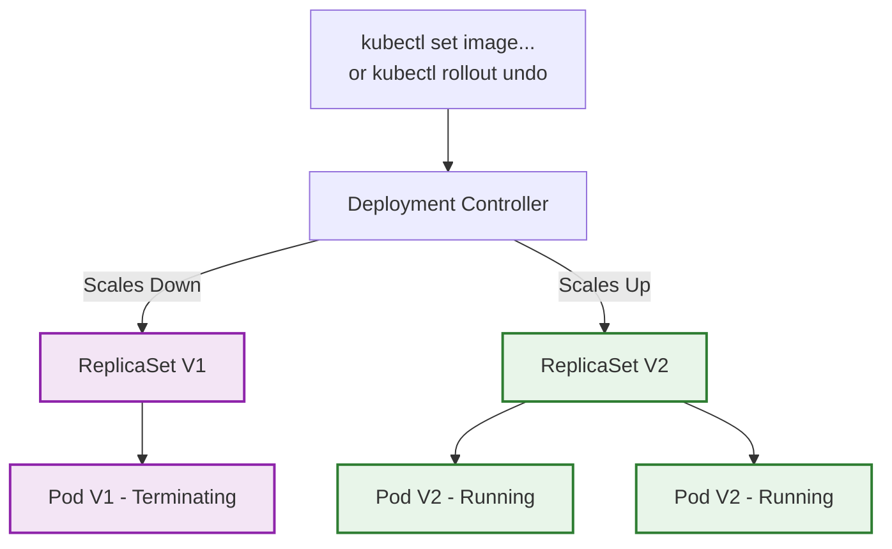

# Scenario 1 The HPA Architecture
This shows how the cluster monitors itself and scales automatically without human intervention.



# Scenario 2: Rollout & Rollback Architecture
This shows how Kubernetes achieves zero-downtime deployments. It creates a new ReplicaSet alongside the old one, scaling one up while scaling the other down.



## End-to-End Testing Playbook
Follow these steps exactly to see the orchestration magic happen.
### 1.Enable the Metrics Server:
Crucial for Autoscaling.
By default, Minikube doesn't track CPU/RAM metrics. We have to turn on the Metrics Server add-on so the HPA has data to read.
```Bash
minikube addons enable metrics-server
```
Wait about 60 seconds. You can verify it's working by running kubectl top nodes. If it shows CPU usage, you are ready.
### 2.Build the Images in Minikube:
Build V1 and V2.
Point your terminal to Minikube's Docker daemon, then build the image as v1.
```Bashe
val $(minikube docker-env)
docker build -t stress-api:v1 
```
Preparation for the rollout test later: Let's pretend we changed the code. Build it again as v2.Bashdocker build -t stress-api:v2 .
### 3.Deploy the Infrastructure:
Apply the YAML file containing the Deployment, Service, and HPA.
```Bash
kubectl apply -f k8s.yaml
```
Check the HPA status:
```Bash
kubectl get hpa
```
Note: The TARGETS column will likely say <unknown>/50% for a minute or two while the Metrics Server gathers initial data. Wait until it says 1%/50% or similar before proceeding.
### 4.Test 1: The Traffic Spike:
Triggering the HPA.
Let's flood the /stress endpoint. We will run a temporary pod inside the cluster that loops HTTP requests as fast as possible to burn the CPU.
Open a new terminal tab and run the load generator:
```Bash
kubectl run -i --tty load-generator --rm --image=busybox:1.28 --restart=Never -- /bin/sh -c "while sleep 0.01; do wget -q -O- http://stress-api-service/stress; done"
```
In your original terminal, watch the HPA react:
```Bash
kubectl get hpa -w
```
The Payoff: Over the next 1-3 minutes, you will see the CPU target shoot up (e.g., 250%/50%), and the REPLICAS column will automatically jump from 1 up to a max of 10. You just automated your bash script!
(Stop the load generator with Ctrl+C when done. The HPA will automatically scale down after about 5 minutes of quiet time).
### 5.Test 2: Deployment Rollout:
Zero-downtime updates.
Let's push v2 of our app. We don't delete the deployment; we just tell Kubernetes we want a new image.
Run this command to trigger the rollout:
```Bash
kubectl set image deployment/stress-api-deployment stress-api=stress-api:v2
```
Watch the magic happen live:
```Bash
kubectl rollout status deployment/stress-api-deployment
```
The Payoff: The Controller Manager spins up a new ReplicaSet. It starts a V2 pod, waits for it to be ready, then kills a V1 pod, continuing until all pods are V2. Zero downtime.
### 6.Test 3: Deployment Rollback:
The 'Oops' button.
Let's pretend V2 introduced a terrible bug and production is down. In the old days, you'd scramble to re-deploy old code. In Kubernetes, you just tell the Controller Manager to revert to the previous ReplicaSet state.
```Bash
kubectl rollout undo deployment/stress-api-deployment
```
The Payoff: Kubernetes instantly spins the V1 pods back up and terminates the V2 pods. Crisis averted in seconds.