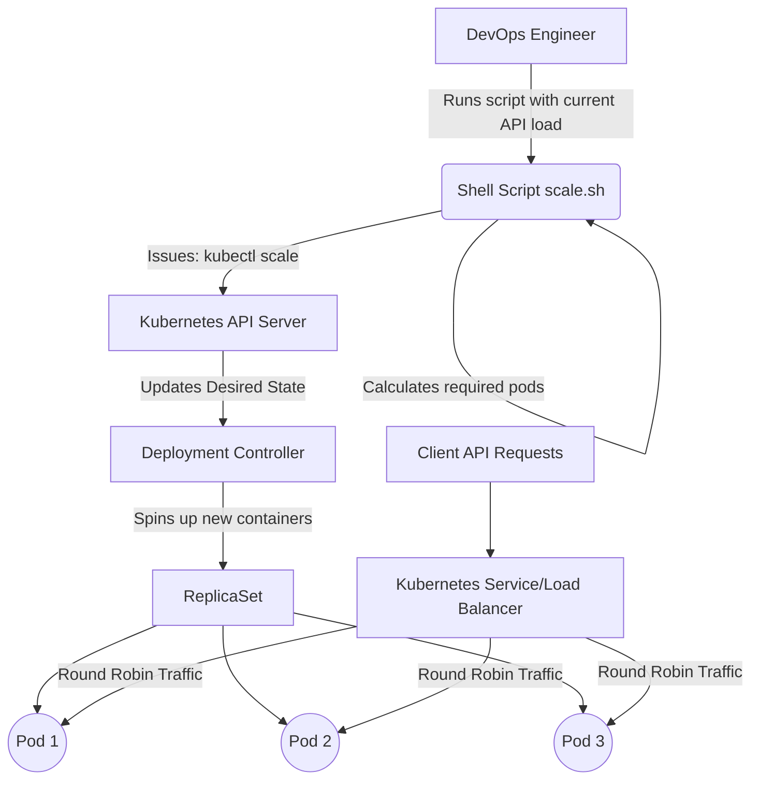

## The Diagnosis: The "Ghost" Image

You likely built the Docker image on your local Mac/PC. But remember: Minikube is a separate virtual machine. It has its own isolated Docker daemon. 

Because Minikube couldn't find the image locally inside its VM, it reached out to the public internet (Docker Hub) and downloaded whatever it could find under `gowtham/poc-backend:latest`. You are currently running a ghost image—not the code you just wrote.

Here is how we bridge the gap and force Minikube to use your actual local code.

---

## The Fix: Build Inside Minikube

We need to build your image directly inside Minikube's environment, and then tell Kubernetes to restart the pods to pick it up.

### 1. Connect to Minikube's Docker Engine
*Crucial Step.* Open your terminal in the same folder as your `Dockerfile` and run this command. This temporarily links your local terminal to Minikube's internal Docker engine.
```bash
eval $(minikube docker-env)
```
### 2. Rebuild the Image
Now it builds directly inside the cluster. Run your standard Docker build command. Because of the previous step, this image is now being saved directly inside Minikube!

```Bash
docker build -t gowtham/poc-backend:latest .
```
### 3. Update Your YAML (Optional but Recommended)
To ensure Minikube never tries to download this image from the internet and strictly uses your local build, open your deployment.yaml and change the imagePullPolicy to Never:

```YAML
    image: gowtham/poc-backend:latest
    imagePullPolicy: Never # <-- Change this from IfNotPresent
```
Then apply the change:

```Bash
kubectl apply -f deployment.yaml
```
### 4. Force the Deployment to Restart
Even if the image is updated, Kubernetes won't restart the pod automatically unless the YAML configuration changes. Tell Kubernetes to roll out a fresh set of pods:

```Bash
kubectl rollout restart deployment poc-backend-deployment
```
### 5. Verify the Fix
Watch your pods spin up. It should only take a few seconds.

```Bash
kubectl get pods
```
Once it says Running with 1/1 Ready, check the logs to see your Express server actually breathing:

```Bash
kubectl logs -l app=poc-backend
```




```mermaid
flowchart TB
    classDef host fill:#e3f2fd,stroke:#1565c0,stroke-width:2px;
    classDef mini fill:#f3e5f5,stroke:#7b1fa2,stroke-width:2px;
    classDef action fill:#fff3e0,stroke:#e65100,stroke-width:2px,stroke-dasharray: 5 5;

    subgraph SharedEngine ["Approach 1: eval $(minikube docker-env) - 'The Shared Engine'"]
        direction LR
        Terminal1("Your Terminal\n(Mac/Windows)"):::host
        MinikubeDocker1[("Minikube's Internal\nDocker Engine")]:::mini
        Pod1("Kubernetes Pod"):::mini
        
        Terminal1 -- "1. docker build\n(Bypasses your laptop entirely)" --> MinikubeDocker1
        MinikubeDocker1 -. "2. Image is instantly available\n(Zero transfer time)" .-> Pod1
    end

    subgraph DeliveryTruck ["Approach 2: minikube image load - 'The Delivery Truck'"]
        direction LR
        Terminal2("Your Terminal\n(Mac/Windows)"):::host
        HostDocker[("Your Laptop's\nDocker Engine")]:::host
        Loader{"minikube image load\n(The Truck)"}:::action
        MinikubeCache[("Minikube's Internal\nImage Cache")]:::mini
        Pod2("Kubernetes Pod"):::mini

        Terminal2 -- "1. docker build" --> HostDocker
        HostDocker -- "2. Zips heavy image file" --> Loader
        Loader -- "3. Uploads file into VM" --> MinikubeCache
        MinikubeCache -. "4. Image is finally available" .-> Pod2
    end
```

## Here is your exact playbook to test this from end to end.
### 1.Make the Script Executable:Linux/Mac requires explicit permission to run scripts.First, ensure your terminal has permission to execute the bash script. 
Navigate to the folder containing scale-pods.sh and run:
```Bash
chmod +x scale-pods.sh
```
### 2.Simulate a Traffic Spike:Triggering the Kubernetes API.Right now, you should have 1 pod running. Let's pretend a marketing campaign just launched, and you are suddenly getting 130 Requests Per Second (RPS).Run your script:
```Bash
./scale-pods.sh 130
```
Expected output: The script will calculate that (130 + 50 - 1) / 50 = 3. It will issue the command to scale to 
### 3 replicas.3.Watch the Pods Spin Up:Watching the Controller Manager in real-time.Immediately run this command to watch the cluster state change live. The -w flag means "watch"—it will keep your terminal open and print a new line every time a pod state changes.
```Bash
kubectl get pods -w
```
You will see the Controller Manager notice the mismatch (Desired: 3, Current: 1) and immediately spin up two new poc-backend-deployment pods. Press Ctrl + C to exit the watch mode once they all say Running.
### 4.Get Your Service URL:Getting the local bridge URL.Because you are using Minikube and a NodePort service, you need the exact IP and port Minikube is using to expose your service to your laptop. Run:
```Bash
minikube service poc-backend-service --url
```
Copy the URL it outputs (it will look something like [http://192.168.49.2:31234](http://192.168.49.2:31234)).
### 5.Test the Load Balancer:The ultimate proof of orchestration.Your server.js code is brilliant because it returns os.hostname(), which in Kubernetes translates directly to the Pod Name.Let's fire 5 quick requests to your service to see the Kubernetes kube-proxy distributing the traffic. Run this bash loop (replace the URL with the one you copied in Step 4):
```Bash
for i in {1..5}; do curl -s http://YOUR_MINIKUBE_URL/api/process | grep servedByPod; done
```
The Payoff: You will see the servedByPod value change between the 3 different pod names! The Kubernetes Service is actively round-robin balancing your API requests across the replicas.
### 6.Scale Back Down:Cleaning up.The traffic spike is over. Let's say load drops back to 30 RPS. Run your script again:
```Bash
./scale-pods.sh 30
```
Run kubectl get pods and you will see Kubernetes instantly terminating 2 of the pods, returning your desired state to 1.The Principal Engineer Insight: What you just built is a manual autoscaler. You wrote the logic outside the cluster (in bash) and pushed the decision in. In a production environment, we actually configure Kubernetes to do this math itself based on CPU or memory usage.