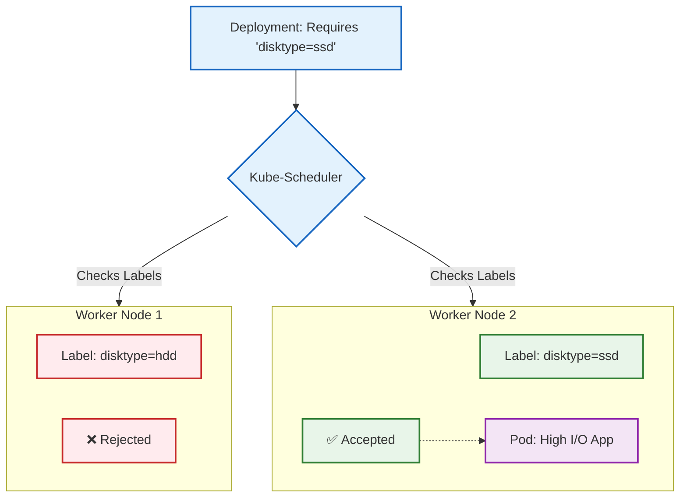
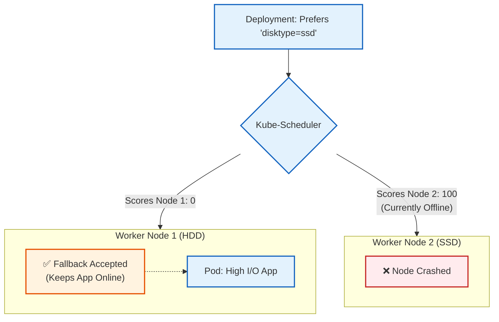

# NodeSelector #

## Definition & Scenario ##

1. Why we use it: By default, the Kubernetes Scheduler assigns pods to nodes purely based on available CPU and RAM. However, nodeSelector forces the Scheduler to only place a pod on a node that has a specific, matching label.
2. Real-world Scenario:
 1. Hardware requirements: You have a machine learning pod that must run on a node with an expensive Nvidia GPU (hardware: gpu).
 2. Disk Performance: Your database pod requires high-speed NVMe drives, so you constrain it to nodes labeled disktype: nvme.
 3. Compliance: You have strict financial workloads that can only run on physically secured, compliant servers (security: pci-dss).



# End-to-End Testing Playbook #
To prove this works, we need a cluster with more than one node. Minikube can actually simulate a multi-node cluster locally!
1. Spin up a 2-Node Cluster:Creating a multi-node environment.If you have Minikube running, stop and delete it to start fresh with a two-node setup.
```Bash
minikube delete
minikube start --nodes 2
```
Verify you have two nodes (usually named minikube and minikube-m02):
```Bash
kubectl get nodes
```
2. Label the Node:Acting as the Datacenter Admin.Let's pretend minikube-m02 just got a brand new NVMe SSD installed. We need to tell the Kubernetes API about it by applying a label.
```Bash
kubectl label nodes minikube-m02 disktype=ssd
```
Verify the label was successfully attached:
```Bash
kubectl get nodes --show-labels | grep disktype
```
3. Reset your Terminal:Disconnect from Minikube's engine.First, let's make sure your terminal is talking to your laptop's normal Docker engine again. Run this to undo the environment mapping:
```Bash
eval $(minikube docker-env -u)
```
(Alternatively, just open a brand new terminal tab).
4. Build the Image Locally:Build on your laptop.Now, build the image just like a standard Docker workflow. This saves the image to your Mac/PC's local Docker cache.
```Bash
docker build -f Dockerfile.selector -t high-io-app:v1 .
```
5. Load the Image into Minikube:The Delivery Truck.Now, push that image from your laptop into the entire Minikube cluster (both nodes). Depending on your machine's speed, this might take 10-30 seconds.
```Bash
minikube image load high-io-app:v1
```
6. Deploy the Workload:Testing the Scheduler.Apply your YAML manifest:
```Bash
kubectl apply -f nodeselector.yaml
```
7. Verify Node Placement:The Ultimate Proof.Check where the Scheduler placed your pods using the -o wide flag, which reveals the NODE column.

```Bash
kubectl get pods -o wide
```
The Payoff: Look at the NODE column. Even though the cluster has two nodes, you will see that both pods were forced onto minikube-m02. The Scheduler completely ignored the primary node because it lacked the disktype: ssd label!The Principal Engineer Caveat: nodeSelector is a "hard" requirement. If a node loses that label, or if that node crashes, the pods will go into a Pending state and your app will be offline because Kubernetes refuses to put them anywhere else.

# Node Affinity

This is the exact progression an engineer must make to design highly available (HA) systems.
Using nodeSelector is dangerous because it is a hard requirement. If your single SSD node crashes, your application goes completely offline because the Scheduler refuses to place the pods anywhere else.

By upgrading to Node Affinity, we can give the Scheduler a soft preference: "I really want this pod on an SSD node. But if one isn't available, just put it on a normal node so the application stays online."

Here is your Principal Engineer guide to soft Node Affinity.

## Node Affinity (Soft Preference)
Definition & Scenario
Why we use it: Node Affinity allows for highly expressive, weighted rules (In, NotIn, Exists). By using preferredDuringSchedulingIgnoredDuringExecution, we assign a "weight" to a rule. The Scheduler scores every node, and places the pod on the highest-scoring node. If the preferred node is dead, the standard nodes still get a score of 0 (which is better than failing), so the pod schedules there.

Real-world Scenario: Best-effort performance routing. You want your data-crunching API to run on fast SSDs if they are available, but if the cloud provider has an outage in that availability zone, you want the API to gracefully degrade and run on standard HDDs rather than crashing.

## Mermaid Architecture
Notice how the Scheduler calculates a "score" for each node. If the SSD node is offline, the normal node wins by default, keeping your app alive.


#  End-to-End Testing PlaybookLet's test the fallback mechanism. We will deploy it while the SSD is available, verify it works, then simulate a hardware failure and watch Kubernetes gracefully fall back to the slower node.
1. Reset the Cluster State:
Clean up the previous test.
Delete the old nodeSelector deployment so we have a clean slate:
```Bash
kubectl delete deployment high-io-deployment
```
Ensure minikube-m02 still has the disktype=ssd label from your previous test:
```Bash
kubectl get nodes --show-labels | grep disktype
```
2. Test 1: The Happy Path:
Deploying with Affinity.
Apply your new affinity manifest:
```Bash
kubectl apply -f node-affinity.yaml
```
Check where the pods landed:
```Bash
kubectl get pods -o wide
```
Result: Just like before, both pods should land on minikube-m02 because it scored 100 points, while minikube (Node 1) scored 0 points.
3. Test 2: The Crash Simulation:
Simulating hardware loss.
Let's pretend the SSD drive caught fire and we had to replace the node with a standard HDD node. We will simulate this by removing the label from Node 2.
Remove the label (the minus - at the end tells K8s to delete the label):
```Bash
kubectl label nodes minikube-m02 disktype-
```
4. Trigger a Rollout:Forcing the Scheduler to re-evaluate.Existing pods aren't evicted when labels change (because of IgnoredDuringExecution). To force the Scheduler to make a new decision, let's restart the deployment:
```Bash
kubectl rollout restart deployment affinity-io-deployment
```
5. Verify the Fallback:The Ultimate HA Proof.Check where the new pods landed:
```Bash
kubectl get pods -o wide
```
The Payoff: Because neither node has the disktype=ssd label, both nodes score 0. Instead of crashing in a Pending state (like nodeSelector would have done), the Scheduler falls back to standard round-robin logic. You will see your pods happily running across your available nodes. You just engineered High Availability!