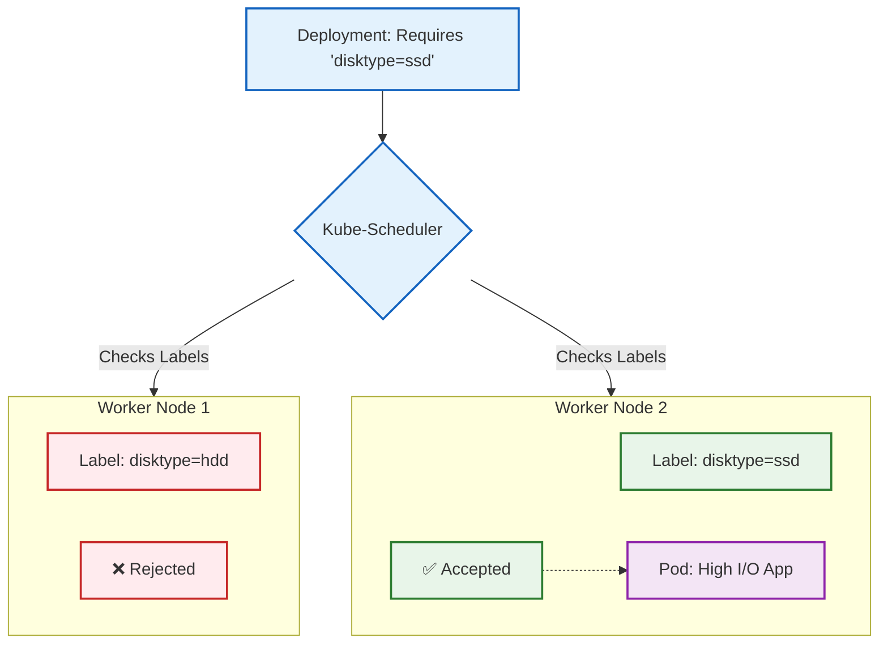

# NodeSelector

## Definition & Scenario

1. Why we use it: By default, the Kubernetes Scheduler assigns pods to nodes purely based on available CPU and RAM. However, nodeSelector forces the Scheduler to only place a pod on a node that has a specific, matching label.
2. Real-world Scenario:
 1. Hardware requirements: You have a machine learning pod that must run on a node with an expensive Nvidia GPU (hardware: gpu).
 2. Disk Performance: Your database pod requires high-speed NVMe drives, so you constrain it to nodes labeled disktype: nvme.
 3. Compliance: You have strict financial workloads that can only run on physically secured, compliant servers (security: pci-dss).



# End-to-End Testing Playbook
To prove this works, we need a cluster with more than one node. Minikube can actually simulate a multi-node cluster locally!
1. Spin up a 2-Node Cluster:Creating a multi-node environment.If you have Minikube running, stop and delete it to start fresh with a two-node setup.
```Bash
minikube delete
minikube start --nodes 2
```
Verify you have two nodes (usually named minikube and minikube-m02):
```Bash
kubectl get nodes
```
2. Label the Node:Acting as the Datacenter Admin.Let's pretend minikube-m02 just got a brand new NVMe SSD installed. We need to tell the Kubernetes API about it by applying a label.
```Bash
kubectl label nodes minikube-m02 disktype=ssd
```
Verify the label was successfully attached:
```Bash
kubectl get nodes --show-labels | grep disktype
```
3. Reset your Terminal:Disconnect from Minikube's engine.First, let's make sure your terminal is talking to your laptop's normal Docker engine again. Run this to undo the environment mapping:
```Bash
eval $(minikube docker-env -u)
```
(Alternatively, just open a brand new terminal tab).
4. Build the Image Locally:Build on your laptop.Now, build the image just like a standard Docker workflow. This saves the image to your Mac/PC's local Docker cache.
```Bash
docker build -f Dockerfile.selector -t high-io-app:v1 .
```
5. Load the Image into Minikube:The Delivery Truck.Now, push that image from your laptop into the entire Minikube cluster (both nodes). Depending on your machine's speed, this might take 10-30 seconds.
```Bash
minikube image load high-io-app:v1
```
6. Deploy the Workload:Testing the Scheduler.Apply your YAML manifest:
```Bash
kubectl apply -f nodeselector.yaml
```
7. Verify Node Placement:The Ultimate Proof.Check where the Scheduler placed your pods using the -o wide flag, which reveals the NODE column.```Bash
kubectl get pods -o wide
```
The Payoff: Look at the NODE column. Even though the cluster has two nodes, you will see that both pods were forced onto minikube-m02. The Scheduler completely ignored the primary node because it lacked the disktype: ssd label!The Principal Engineer Caveat: nodeSelector is a "hard" requirement. If a node loses that label, or if that node crashes, the pods will go into a Pending state and your app will be offline because Kubernetes refuses to put them anywhere else.