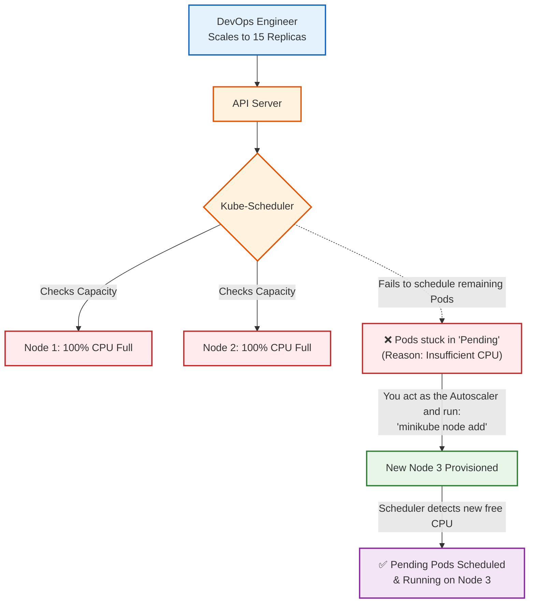

In enterprise environments, scaling happens on two completely different levels:

- Pod Scaling (HPA): Adding more Pods when CPU/Memory gets high.
- Node Scaling (Cluster Autoscaler): Buying/adding new physical hardware (VMs) when your cluster runs out of room to put those new Pods.

To understand how Cloud Autoscalers (like AWS Karpenter or GCP Cluster Autoscaler) work, you must first act as the autoscaler manually in your local environment. We call this the "Pending Pod Trigger" pattern.

Here is your Principal Engineer deep dive into manual Node Spin-Up and resource exhaustion.

# Node Spin-Up (Resource Exhaustion Scenario)

## Definition & Scenario
- Why we use it: Worker nodes have finite CPU and RAM. When you configure Pods with requests (guaranteed minimum resources), the Kubernetes Scheduler subtracts those resources from the node's capacity. When the cluster is full, new pods go into a Pending state. The Cluster Autoscaler watches for these Pending pods and dynamically provisions new hardware.
- Real-world Scenario: It is Black Friday. Your Node.js E-Commerce API gets a massive traffic spike. The Horizontal Pod Autoscaler (HPA) tries to scale the API from 2 pods to 20 pods. Your current nodes can only fit 5 pods. The remaining 15 pods sit in Pending. The Cluster Autoscaler sees this, requests 3 new EC2 instances from AWS, and once they boot up, Kubernetes schedules the 15 pending pods onto them.

## Mermaid Architecture

Notice the distinct flow: Exhaustion -> Pending State -> Node Provisioning -> Resolution.



## End-to-End Testing Playbook (Manual CA Simulation)

Right now, you have a 2-node cluster (from your Calico CNI fix earlier). Let's intentionally overload the cluster to break it, and then fix it by spinning up a new node manually.

1. Build and Load the Image:
Prepare the workload.
Ensure your terminal is local, build the image, and deliver it to your 2-node cluster.

```Bash
eval $(minikube docker-env -u)
docker build -f Dockerfile.heavy -t heavy-api:v1 .
minikube image load heavy-api:v1
```
2. Deploy the App:
The Baseline.
Apply the manifest. Because it only asks for 2 replicas, it will fit safely in your current cluster.

```Bash
kubectl apply -f heavy-deployment.yaml
kubectl get pods
```
Ensure both pods are Running before moving to the next step.

3. Scale the Workload to Exhaustion:
Simulate Black Friday.
Let's demand 15 pods. Because each requires 500m CPU, 15 pods require 7.5 entire CPU cores. Your local cluster doesn't have that much unreserved CPU!
```Bash
kubectl scale deployment heavy-api-deployment --replicas=15
```
- Faced one issue (Overpower the Cluster because I'm using mac)

The Fix: Overpower the Cluster
To properly simulate resource exhaustion on a machine as powerful as yours, we just need to ask for an absurd amount of CPU. You have two ways to do this.

The Quick Fix (Just add more Pods)
Keep the YAML exactly as it is, but scale the deployment to a number that requires more than 22 cores. Let's ask for 50 pods (which would require 25 cores):

```Bash
kubectl scale deployment heavy-api-deployment --replicas=50
```
Wait a few seconds, then run kubectl get pods. You should finally see a chunk of them stuck in Pending!

```Bash
kubectl get pods        
```

```log
NAME                                    READY   STATUS    RESTARTS   AGE
heavy-api-deployment-698cb78c58-5fx4q   0/1     Pending   0          6s
heavy-api-deployment-698cb78c58-ckvts   0/1     Pending   0          6s
heavy-api-deployment-698cb78c58-d4jh5   0/1     Pending   0          6s
```
The Fix: Be Specific like a Sniper
As a Principal Engineer, when you have 50 pods and only a few are failing, you don't describe all of them. You isolate one specific failing pod.

Copy the name of one of your Pending pods and describe just that one pod (no grep needed):

```Bash
kubectl describe pod heavy-api-deployment-698cb78c58-5fx4q
```
If you scroll to the very bottom of that output to the Events section, you will see the exact warning from the Scheduler:
Warning  FailedScheduling ... 0/2 nodes are available: 2 Insufficient cpu.

5. Manually Spin Up a Node
Act as the Cluster Autoscaler

The Final Step: Fix the ClusterNow that you have proven the cluster is out of CPU and pods are stuck in Pending, act as the Autoscaler and provision the 3rd node!
```Bash
minikube node add
```
Once it boots up, run kubectl get pods again. You will see those exact Pending pods instantly transition to Running as the Scheduler drops them onto the fresh CPU cores of the new node.

6. Watch the Resolution:
The Ultimate Proof.
As soon as the new node boots and joins the cluster (giving the Scheduler fresh CPU cores to use), watch the pods:
```Bash
kubectl get pods -o wide
```
The Payoff: Without you touching the deployment again, the Scheduler will instantly detect the new node, consume its free CPU, and transition the Pending pods to Running on your brand new minikube-m03 node!

You have successfully proven the autoscaling concept! The Scheduler did exactly what it was supposed to do: it saw the new CPU cores on minikube-m03 and immediately assigned the Pending pods to it.
However, you just ran into the exact same local-testing constraint we hit earlier during the Node Affinity test.
### The Diagnosis: Why ErrImageNeverPull?
In a real cloud environment (like AWS EKS), the new node would just download the Docker image from a private container registry over the internet.But because we are testing locally and explicitly set imagePullPolicy: Never in your YAML, you told the Kubelet on minikube-m03: "Do not download this from the internet. Use the image on your local hard drive."
Since minikube-m03 is a brand-new virtual machine born less than two minutes ago, its internal Docker cache is completely empty! It doesn't have the heavy-api:v1 image yet.
- The Fix: The Delivery Truck
We need to push the image from your laptop into the newly created node.

1. Load the Image:
Send the image to the new node.
Use the Minikube delivery truck command. This will look at your 3-node cluster and copy the image into any node that doesn't have it yet (specifically minikube-m03).
```Bash
minikube image load heavy-api:v1
```
2. Restart the Deployment:
Kick the Controller.
Those pods might be stuck in a back-off loop waiting for the image. Force Kubernetes to recreate them so they immediately see the image in the cache.
```Bash
kubectl rollout restart deployment heavy-api-deployment
```
3. Verify the Fix:
The Ultimate Proof.
Check your pods again.
```Bash
kubectl get pods -o wide
```
You will now see your pods transitioning to Running on minikube-m03!By completing this, you have manually simulated exactly what the Kubernetes Cluster Autoscaler does in enterprise production environments every single day.

