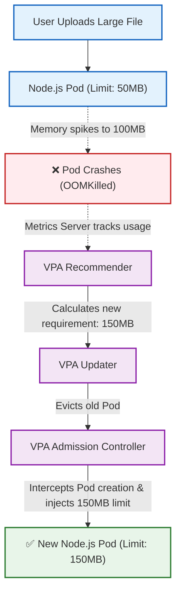

# Vertical Pod Autoscaler (VPA)
## Definition & Scenario
- Why we use it: HPA creates more pods. But what if your application has a memory leak, or runs a heavy data-processing task that requires a massive amount of RAM? If a pod only has 256MB of RAM allocated, and the task needs 2GB, adding 50 more pods via HPA won't fix the problem—all 50 pods will just crash with OOMKilled (Out of Memory). VPA solves this by watching the pod's actual usage and automatically increasing the CPU/RAM limits of the pod itself.

- Real-world Scenario: You deploy a Java Spring Boot microservice or a Node.js data parser. You guess it needs 500MB of RAM. A month later, users upload larger files, and the app starts crashing with Out Of Memory errors. Instead of manually guessing the new RAM requirements and editing YAMLs, VPA watches the app over time, evicts the crashing pod, and respawns it with exactly the 1.2GB of RAM it actually needs.

## Mermaid Architecture



## The Master Playbook: 
Vertical Pod Autoscaling
1. Step 1: Enable Metrics & Install VPA:
Prepare the Cluster.
Ensure your local cluster can read CPU/Memory metrics, and manually install the official VPA controllers from GitHub (bypassing the broken Minikube addon).
```Bash
# 1. Enable the heart monitor
minikube addons enable metrics-server

# 2. Download the official VPA source code
git clone https://github.com/kubernetes/autoscaler.git

# 3. Install VPA directly into the cluster
cd autoscaler/vertical-pod-autoscaler
./hack/vpa-up.sh

# 4. Return to your project folder
cd ../..

# 5. Verify the 3 VPA brains are running
kubectl get pods -n kube-system | grep vpa
```
2. Step 2: Build and Load the Image:
Bypass ErrImageNeverPull.
Ensure your terminal is pointing to your laptop's Docker engine, build the image, and deliver it to the Minikube cache.
```Bash
eval $(minikube docker-env -u)
docker build -f Dockerfile.vpa -t memory-hog:v1 .
minikube image load memory-hog:v1
```
3. Step 3: Deploy the Starved App:
Apply the YAML.
Create or update your vpa-poc.yaml to include the strict 50Mi limit and set VPA to Auto.
```Bash
kubectl apply -f vpa-poc.yaml
```
Verify the pod starts with exactly 50Mi:Bashkubectl describe pod -l app=memory-hog | grep -A 4 "Limits:"
4. Step 4: Port-Forward:
Open the tunnel.
In a second terminal window, open the connection to the service:
```Bash
kubectl port-forward svc/memory-hog-svc 8080:80
```
5. Step 5: Cause the OOMKill:
Trigger the Linux Kernel.
In your first terminal, rapidly hit the endpoint to bloat the memory array past 50MB. Run this 4 to 6 times until the connection drops:
```Bash
curl http://localhost:8080/allocate
```
Once it hangs or fails, check the pod status. You will see it was executed by the system:
```Bash
kubectl get pods
```
(Look for OOMKilled or CrashLoopBackOff and RESTARTS: 1)
6. Step 6: View the VPA Recommendation:
Check the Math.
The VPA Recommender watched the crash and calculated a safe amount of memory needed to prevent it from happening again.
```Bash
kubectl describe vpa memory-hog-vpa | grep -A 5 "Recommendation:"
```
(You should see it recommending around 250Mi or more).
7. Step 7: Force the VPA Injection:
The Bouncer Acts.
Because the container merely restarted inside the existing pod, the VPA Admission Controller hasn't had a chance to rewrite the YAML yet. Delete the pod to force the ReplicaSet to create a brand new one.
```Bash
kubectl delete pod -l app=memory-hog
```
Wait 5 seconds for the new pod to spin up, and then ask for its limits:
```Bash
kubectl describe pod -l app=memory-hog | grep -A 4 "Limits:"
```
The Final Result
When you run that final command, the limit will no longer be 50Mi.
You will see that the VPA Admission Controller intercepted the API request, completely ignored your YAML file, and automatically injected the ~250Mi memory limit into the new pod so it can survive the memory leak.